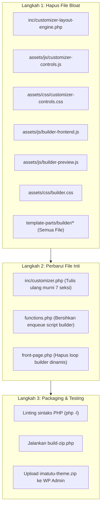

# PANDUAN IMPLEMENTASI TEKNIS: REFAKTOR TEMA IMATUTU
## "Lean Dedicated Customizer" (Solusi Anti-Crash & Ringan untuk Hosting Plesk)

> **Dokumen ini ditujukan untuk**: Junior Web Programmer atau Model AI.  
> **Tujuan**: Memperbaiki masalah Customizer WordPress yang membeku (*blank/freeze screen*), membuang modul *over-engineered* yang membebani server, dan mewujudkan antarmuka kustomisasi visual yang ringan, cepat, dan 100% stabil dengan tetap mempertahankan konten asli Imatutu.

---

## 1. LAMPIRAN ILUSTRASI TAMPILAN AKHIR (TARGET UI)

Gunakan ilustrasi berikut sebagai acuan visual hasil akhir yang harus dicapai:

### A. Tampilan UI WordPress Customizer & Live Preview (Target Utama)
Sidebar kiri menampilkan panel kustomisasi native yang bersih dan terstruktur (*Imatutu Theme Settings*), terbagi ke dalam 7 accordion seksi. Pratinjau di sebelah kanan merespons perubahan teks dan warna secara *real-time*.


---

### B. Tampilan Halaman Depan Website Modern (Front-End Result)
Desain korporat modern bergaya enterprise ala Pertamina.com dengan navigasi *glassmorphism*, hero bernilai SEO tinggi, 3 kartu layanan bento-grid, metrik statistik, dan logo partner.


---

### C. Komparasi Visual Sebelum vs Sesudah Perbaikan
Transformasi dari website lama yang kaku dan lambat menjadi portal BPO korporat berkecepatan tinggi.


---

## 2. ANALISIS AKAR MASALAH (MENGAPA CUSTOMIZER SAAT INI BLANK?)

Berdasarkan investigasi teknis pada kode sumber dan server hosting:
1. **Over-Engineering (Layout Builder Bloat)**:
   File `inc/customizer-layout-engine.php` (642 baris) dan folder `template-parts/builder/` mencoba membangun *mini-page-builder* di dalam Customizer dengan mendaftarkan lebih dari **200+ kontrol dinamis**.
2. **Limitasi Server Hosting**:
   Server hosting (Plesk, PHP 8.2) memiliki batasan `memory_limit` 128MB dan `max_execution_time` 30s. Saat WordPress mencoba mengonversi ratusan kontrol tersebut menjadi JSON (`wp_json_encode`), server kehabisan memori atau mengalami timeout.
3. **Script Watchdog Merusak Siklus Ready**:
   Pada `assets/js/customizer-controls.js` terdapat fungsi `setTimeout(..., 2000)` yang memaksa menghapus class loading setelah 2 detik. Hal ini memotong proses inisialisasi iframe WordPress secara prematur, menyebabkan layar membeku dalam kondisi putih polos.

**Kesimpulan Solusi**: Sederhanakan Customizer menjadi **"Lean Dedicated Customizer"** dengan hanya mempertahankan **~45 kontrol native WordPress murni** untuk konten riil Imatutu.

---

## 3. RENCANA TINDAKAN (ACTION PLAN)



---

## 4. SPESIFIKASI FILE & KODE LENGKAP

### 4.1 File yang WAJIB DIHAPUS
Hapus file dan folder berikut dari direktori tema:
- `inc/customizer-layout-engine.php`
- `assets/js/customizer-controls.js`
- `assets/css/customizer-controls.css`
- `assets/js/builder-frontend.js`
- `assets/js/builder-preview.js`
- `assets/css/builder.css`
- Seluruh isi folder `template-parts/builder/` (dan foldernya)

---

### 4.2 File `front-page.php` (Ganti dengan Kode Ini)
Bersihkan dari *loop* builder dinamis. Hanya merender 4 seksi utama:

```php
<?php
/**
 * The front page template file
 *
 * @package Imatutu
 */

if (!defined('ABSPATH')) {
    exit;
}

get_header();
?>

<main id="primary" class="site-main">
    <?php
    get_template_part('template-parts/home/section', 'hero');
    get_template_part('template-parts/home/section', 'services');
    get_template_part('template-parts/home/section', 'stats');
    get_template_part('template-parts/home/section', 'clients');
    ?>
</main>

<?php
get_footer();
```

---

### 4.3 File `functions.php` (Ganti dengan Kode Ini)
Hapus seluruh referensi ke builder CSS/JS dan customizer-controls. Hanya memuat aset penting:

```php
<?php
/**
 * Imatutu Modern Corporate functions and definitions
 *
 * @package Imatutu
 */

if (!defined('ABSPATH')) {
    exit;
}

if (!function_exists('imatutu_setup')) :
    function imatutu_setup() {
        load_theme_textdomain('imatutu', get_template_directory() . '/languages');
        add_theme_support('automatic-feed-links');
        add_theme_support('title-tag');
        add_theme_support('post-thumbnails');
        set_post_thumbnail_size(1200, 630, true);

        add_theme_support('custom-logo', array(
            'height'      => 80,
            'width'       => 260,
            'flex-height' => true,
            'flex-width'  => true,
            'unlink-homepage-logo' => false,
        ));

        register_nav_menus(array(
            'primary' => esc_html__('Primary Navigation', 'imatutu'),
            'footer'  => esc_html__('Footer Navigation', 'imatutu'),
        ));

        add_theme_support('html5', array(
            'search-form',
            'comment-form',
            'comment-list',
            'gallery',
            'caption',
            'style',
            'script',
        ));

        add_theme_support('customize-selective-refresh-widgets');
        add_theme_support('responsive-embeds');
    }
endif;
add_action('after_setup_theme', 'imatutu_setup');

/**
 * Enqueue scripts and styles.
 */
if (!function_exists('imatutu_scripts')) {
    function imatutu_scripts() {
        // Google Fonts: Plus Jakarta Sans
        wp_enqueue_style(
            'imatutu-google-fonts',
            'https://fonts.googleapis.com/css2?family=Plus+Jakarta+Sans:ital,wght@0,300;0,400;0,500;0,600;0,700;0,800;1,400;1,600&display=swap',
            array(),
            null
        );

        // Main Theme CSS
        $css_ver = file_exists(get_template_directory() . '/assets/css/main.css') 
            ? filemtime(get_template_directory() . '/assets/css/main.css') 
            : '2.1.0';
        wp_enqueue_style('imatutu-main', get_template_directory_uri() . '/assets/css/main.css', array('imatutu-google-fonts'), $css_ver);
        wp_enqueue_style('imatutu-style', get_stylesheet_uri(), array('imatutu-main'), '2.1.0');

        // Dynamic Customizer Styling (Colors & Typography)
        $custom_css = '';
        if (function_exists('imatutu_get_color_css')) {
            $custom_css .= imatutu_get_color_css();
        }
        if (function_exists('imatutu_get_typography_css')) {
            $custom_css .= imatutu_get_typography_css();
        }
        if (!empty($custom_css)) {
            wp_add_inline_style('imatutu-main', $custom_css);
        }

        // Main Theme JavaScript (Vanilla JS for sticky header & mobile menu)
        $js_ver = file_exists(get_template_directory() . '/assets/js/main.js') 
            ? filemtime(get_template_directory() . '/assets/js/main.js') 
            : '2.1.0';
        wp_enqueue_script('imatutu-script', get_template_directory_uri() . '/assets/js/main.js', array(), $js_ver, true);
    }
}
add_action('wp_enqueue_scripts', 'imatutu_scripts');

/**
 * Fallback menu when no WordPress menu is assigned yet
 */
if (!function_exists('imatutu_default_primary_menu')) {
    function imatutu_default_primary_menu() {
        $menu_items = array(
            array('title' => 'Home', 'url' => home_url('/')),
            array('title' => 'About Us', 'url' => home_url('/about-us/')),
            array('title' => 'Careers', 'url' => home_url('/careers/')),
            array('title' => 'Gallery', 'url' => home_url('/gallery/')),
            array('title' => 'Contact Us', 'url' => home_url('/contact-us/')),
        );

        echo '<ul class="nav-menu" id="primary-menu">';
        foreach ($menu_items as $item) {
            $is_active = (is_front_page() && $item['title'] === 'Home') ? ' current-menu-item' : '';
            echo '<li class="menu-item' . esc_attr($is_active) . '">';
            echo '<a href="' . esc_url($item['url']) . '">' . esc_html($item['title']) . '</a>';
            echo '</li>';
        }
        echo '</ul>';
    }
}

/**
 * Include Customizer
 */
require_once get_template_directory() . '/inc/customizer.php';
```

---

### 4.4 File `inc/customizer.php` (Ganti dengan Kode Ramping Ini)
File ini hanya mendaftarkan 1 Panel dan 7 Seksi Native tanpa dependensi custom class:

```php
<?php
/**
 * Imatutu Theme Customizer - Lean Dedicated Edition
 *
 * @package Imatutu
 */

if (!defined('ABSPATH')) {
    exit;
}

require_once get_template_directory() . '/inc/customizer-palettes.php';
require_once get_template_directory() . '/inc/customizer-typography.php';

function imatutu_customize_register($wp_customize) {

    // -------------------------------------------------------------
    // Main Customizer Panel
    // -------------------------------------------------------------
    $wp_customize->add_panel('panel_imatutu', array(
        'title'       => esc_html__('Imatutu Theme Settings', 'imatutu'),
        'description' => esc_html__('Configure visual styles, content, partners, contacts, and chatbot integration.', 'imatutu'),
        'priority'    => 25,
    ));

    // =============================================================
    // SECTION 1: Colors & Brand Identity
    // =============================================================
    $wp_customize->add_section('sec_imatutu_colors', array(
        'title'    => esc_html__('1. Colors & Brand Identity', 'imatutu'),
        'panel'    => 'panel_imatutu',
        'priority' => 10,
    ));

    $wp_customize->add_setting('primary_color', array(
        'default'           => '#1559ED',
        'sanitize_callback' => 'sanitize_hex_color',
        'transport'         => 'postMessage',
    ));
    $wp_customize->add_control(new WP_Customize_Color_Control($wp_customize, 'primary_color', array(
        'label'    => esc_html__('Primary Corporate Color', 'imatutu'),
        'section'  => 'sec_imatutu_colors',
    )));

    $wp_customize->add_setting('secondary_color', array(
        'default'           => '#0B192C',
        'sanitize_callback' => 'sanitize_hex_color',
        'transport'         => 'postMessage',
    ));
    $wp_customize->add_control(new WP_Customize_Color_Control($wp_customize, 'secondary_color', array(
        'label'    => esc_html__('Secondary Navy Color', 'imatutu'),
        'section'  => 'sec_imatutu_colors',
    )));

    $wp_customize->add_setting('accent_color', array(
        'default'           => '#E21F23',
        'sanitize_callback' => 'sanitize_hex_color',
        'transport'         => 'postMessage',
    ));
    $wp_customize->add_control(new WP_Customize_Color_Control($wp_customize, 'accent_color', array(
        'label'    => esc_html__('Accent Color', 'imatutu'),
        'section'  => 'sec_imatutu_colors',
    )));

    // =============================================================
    // SECTION 2: Header Settings
    // =============================================================
    $wp_customize->add_section('sec_imatutu_header', array(
        'title'    => esc_html__('2. Header & Navigation', 'imatutu'),
        'panel'    => 'panel_imatutu',
        'priority' => 20,
    ));

    $wp_customize->add_setting('header_brand_text', array(
        'default'           => 'IMATUTU',
        'sanitize_callback' => 'sanitize_text_field',
        'transport'         => 'postMessage',
    ));
    $wp_customize->add_control('header_brand_text', array(
        'label'   => esc_html__('Brand Name Text', 'imatutu'),
        'section' => 'sec_imatutu_header',
        'type'    => 'text',
    ));

    $wp_customize->add_setting('header_subtitle', array(
        'default'           => 'by PT Karya Antara Negeri | PT Karya Antara Benua',
        'sanitize_callback' => 'sanitize_text_field',
        'transport'         => 'postMessage',
    ));
    $wp_customize->add_control('header_subtitle', array(
        'label'   => esc_html__('Company Subtitle / Entity', 'imatutu'),
        'section' => 'sec_imatutu_header',
        'type'    => 'text',
    ));

    $wp_customize->add_setting('header_cta_text', array(
        'default'           => 'Contact',
        'sanitize_callback' => 'sanitize_text_field',
        'transport'         => 'postMessage',
    ));
    $wp_customize->add_control('header_cta_text', array(
        'label'   => esc_html__('Header Button Label', 'imatutu'),
        'section' => 'sec_imatutu_header',
        'type'    => 'text',
    ));

    $wp_customize->add_setting('header_cta_link', array(
        'default'           => 'https://imatutu.com/contact-us/',
        'sanitize_callback' => 'esc_url_raw',
    ));
    $wp_customize->add_control('header_cta_link', array(
        'label'   => esc_html__('Header Button URL', 'imatutu'),
        'section' => 'sec_imatutu_header',
        'type'    => 'url',
    ));

    // =============================================================
    // SECTION 3: Hero Section
    // =============================================================
    $wp_customize->add_section('sec_imatutu_hero', array(
        'title'    => esc_html__('3. Hero Section', 'imatutu'),
        'panel'    => 'panel_imatutu',
        'priority' => 30,
    ));

    $wp_customize->add_setting('hero_heading_1', array(
        'default'           => 'The Trusted Choice For Your Business Support Requirements',
        'sanitize_callback' => 'sanitize_text_field',
        'transport'         => 'postMessage',
    ));
    $wp_customize->add_control('hero_heading_1', array(
        'label'   => esc_html__('Main Hero Title (H1)', 'imatutu'),
        'section' => 'sec_imatutu_hero',
        'type'    => 'text',
    ));

    $wp_customize->add_setting('hero_heading_2', array(
        'default'           => 'Integrated Solutions for All Your Business Needs',
        'sanitize_callback' => 'sanitize_textarea_field',
        'transport'         => 'postMessage',
    ));
    $wp_customize->add_control('hero_heading_2', array(
        'label'   => esc_html__('Hero Subtitle', 'imatutu'),
        'section' => 'sec_imatutu_hero',
        'type'    => 'textarea',
    ));

    $wp_customize->add_setting('hero_bg_image', array(
        'default'           => '',
        'sanitize_callback' => 'esc_url_raw',
    ));
    $wp_customize->add_control(new WP_Customize_Image_Control($wp_customize, 'hero_bg_image', array(
        'label'   => esc_html__('Hero Background Image', 'imatutu'),
        'section' => 'sec_imatutu_hero',
    )));

    $wp_customize->add_setting('hero_cta_primary_text', array(
        'default'           => 'Contact Us',
        'sanitize_callback' => 'sanitize_text_field',
        'transport'         => 'postMessage',
    ));
    $wp_customize->add_control('hero_cta_primary_text', array(
        'label'   => esc_html__('Primary Button Label', 'imatutu'),
        'section' => 'sec_imatutu_hero',
        'type'    => 'text',
    ));

    $wp_customize->add_setting('hero_cta_primary_link', array(
        'default'           => 'https://imatutu.com/contact-us/',
        'sanitize_callback' => 'esc_url_raw',
    ));
    $wp_customize->add_control('hero_cta_primary_link', array(
        'label'   => esc_html__('Primary Button Link', 'imatutu'),
        'section' => 'sec_imatutu_hero',
        'type'    => 'url',
    ));

    $wp_customize->add_setting('hero_cta_secondary_text', array(
        'default'           => 'Our Services',
        'sanitize_callback' => 'sanitize_text_field',
        'transport'         => 'postMessage',
    ));
    $wp_customize->add_control('hero_cta_secondary_text', array(
        'label'   => esc_html__('Secondary Button Label', 'imatutu'),
        'section' => 'sec_imatutu_hero',
        'type'    => 'text',
    ));

    $wp_customize->add_setting('hero_cta_secondary_link', array(
        'default'           => '#services',
        'sanitize_callback' => 'esc_url_raw',
    ));
    $wp_customize->add_control('hero_cta_secondary_link', array(
        'label'   => esc_html__('Secondary Button Link', 'imatutu'),
        'section' => 'sec_imatutu_hero',
        'type'    => 'text',
    ));

    // =============================================================
    // SECTION 4: Services Section
    // =============================================================
    $wp_customize->add_section('sec_imatutu_services', array(
        'title'    => esc_html__('4. Services Section (3 Items)', 'imatutu'),
        'panel'    => 'panel_imatutu',
        'priority' => 40,
    ));

    $wp_customize->add_setting('services_subtitle', array(
        'default'           => 'What We OFFER',
        'sanitize_callback' => 'sanitize_text_field',
        'transport'         => 'postMessage',
    ));
    $wp_customize->add_control('services_subtitle', array(
        'label'   => esc_html__('Section Subtitle', 'imatutu'),
        'section' => 'sec_imatutu_services',
        'type'    => 'text',
    ));

    $wp_customize->add_setting('services_title', array(
        'default'           => 'Taylor Made Solutions for Your Business',
        'sanitize_callback' => 'sanitize_text_field',
        'transport'         => 'postMessage',
    ));
    $wp_customize->add_control('services_title', array(
        'label'   => esc_html__('Section Main Title', 'imatutu'),
        'section' => 'sec_imatutu_services',
        'type'    => 'text',
    ));

    // Service 1
    $wp_customize->add_setting('service_1_title', array(
        'default'           => 'Customer Service Support',
        'sanitize_callback' => 'sanitize_text_field',
        'transport'         => 'postMessage',
    ));
    $wp_customize->add_control('service_1_title', array(
        'label'   => esc_html__('Service 1: Title', 'imatutu'),
        'section' => 'sec_imatutu_services',
        'type'    => 'text',
    ));

    $wp_customize->add_setting('service_1_desc', array(
        'default'           => 'We provide 24/7 contact center services tailored to suit your industry needs from, handling inquiries, transport bookings, handling customer feedback and resolving issues promptly to ensure customer satisfaction. Our team is trained to deliver exceptional service in every interaction.',
        'sanitize_callback' => 'sanitize_textarea_field',
        'transport'         => 'postMessage',
    ));
    $wp_customize->add_control('service_1_desc', array(
        'label'   => esc_html__('Service 1: Description', 'imatutu'),
        'section' => 'sec_imatutu_services',
        'type'    => 'textarea',
    ));

    $wp_customize->add_setting('service_1_image', array(
        'default'           => '',
        'sanitize_callback' => 'esc_url_raw',
    ));
    $wp_customize->add_control(new WP_Customize_Image_Control($wp_customize, 'service_1_image', array(
        'label'   => esc_html__('Service 1: Image', 'imatutu'),
        'section' => 'sec_imatutu_services',
    )));

    // Service 2
    $wp_customize->add_setting('service_2_title', array(
        'default'           => 'Full Technical Support',
        'sanitize_callback' => 'sanitize_text_field',
        'transport'         => 'postMessage',
    ));
    $wp_customize->add_control('service_2_title', array(
        'label'   => esc_html__('Service 2: Title', 'imatutu'),
        'section' => 'sec_imatutu_services',
        'type'    => 'text',
    ));

    $wp_customize->add_setting('service_2_desc', array(
        'default'           => 'Our experts offer reliable troubleshooting and technical assistance, for multiple systems helping clients resolve technical problems efficiently. We focus on quick solutions to minimize downtime.',
        'sanitize_callback' => 'sanitize_textarea_field',
        'transport'         => 'postMessage',
    ));
    $wp_customize->add_control('service_2_desc', array(
        'label'   => esc_html__('Service 2: Description', 'imatutu'),
        'section' => 'sec_imatutu_services',
        'type'    => 'textarea',
    ));

    $wp_customize->add_setting('service_2_image', array(
        'default'           => '',
        'sanitize_callback' => 'esc_url_raw',
    ));
    $wp_customize->add_control(new WP_Customize_Image_Control($wp_customize, 'service_2_image', array(
        'label'   => esc_html__('Service 2: Image', 'imatutu'),
        'section' => 'sec_imatutu_services',
    )));

    // Service 3
    $wp_customize->add_setting('service_3_title', array(
        'default'           => 'Administration Support',
        'sanitize_callback' => 'sanitize_text_field',
        'transport'         => 'postMessage',
    ));
    $wp_customize->add_control('service_3_title', array(
        'label'   => esc_html__('Service 3: Title', 'imatutu'),
        'section' => 'sec_imatutu_services',
        'type'    => 'text',
    ));

    $wp_customize->add_setting('service_3_desc', array(
        'default'           => 'Full accounting services available, teamed up with data processing, general administration and customer service support',
        'sanitize_callback' => 'sanitize_textarea_field',
        'transport'         => 'postMessage',
    ));
    $wp_customize->add_control('service_3_desc', array(
        'label'   => esc_html__('Service 3: Description', 'imatutu'),
        'section' => 'sec_imatutu_services',
        'type'    => 'textarea',
    ));

    $wp_customize->add_setting('service_3_image', array(
        'default'           => '',
        'sanitize_callback' => 'esc_url_raw',
    ));
    $wp_customize->add_control(new WP_Customize_Image_Control($wp_customize, 'service_3_image', array(
        'label'   => esc_html__('Service 3: Image', 'imatutu'),
        'section' => 'sec_imatutu_services',
    )));

    // =============================================================
    // SECTION 5: Global Reach & Stats
    // =============================================================
    $wp_customize->add_section('sec_imatutu_stats', array(
        'title'    => esc_html__('5. Global Reach & Stats', 'imatutu'),
        'panel'    => 'panel_imatutu',
        'priority' => 50,
    ));

    $wp_customize->add_setting('stats_title', array(
        'default'           => 'Our Global Reach',
        'sanitize_callback' => 'sanitize_text_field',
        'transport'         => 'postMessage',
    ));
    $wp_customize->add_control('stats_title', array(
        'label'   => esc_html__('Section Title', 'imatutu'),
        'section' => 'sec_imatutu_stats',
        'type'    => 'text',
    ));

    $wp_customize->add_setting('stats_desc', array(
        'default'           => 'With numerous clients, successful projects and a wide reach, Imatutu is making a mark as the preferred outsourcing partner. We support our global clients, delivering excellence in every project. Our services span across multiple countries and multiple industries, helping businesses achieve their goals globally.',
        'sanitize_callback' => 'sanitize_textarea_field',
        'transport'         => 'postMessage',
    ));
    $wp_customize->add_control('stats_desc', array(
        'label'   => esc_html__('Section Description', 'imatutu'),
        'section' => 'sec_imatutu_stats',
        'type'    => 'textarea',
    ));

    $wp_customize->add_setting('stats_side_image', array(
        'default'           => '',
        'sanitize_callback' => 'esc_url_raw',
    ));
    $wp_customize->add_control(new WP_Customize_Image_Control($wp_customize, 'stats_side_image', array(
        'label'   => esc_html__('Side Image (Global Reach)', 'imatutu'),
        'section' => 'sec_imatutu_stats',
    )));

    // Metric 1
    $wp_customize->add_setting('stat_1_number', array(
        'default'           => '150+',
        'sanitize_callback' => 'sanitize_text_field',
        'transport'         => 'postMessage',
    ));
    $wp_customize->add_control('stat_1_number', array(
        'label'   => esc_html__('Stat 1: Number', 'imatutu'),
        'section' => 'sec_imatutu_stats',
        'type'    => 'text',
    ));
    $wp_customize->add_setting('stat_1_label', array(
        'default'           => 'Client',
        'sanitize_callback' => 'sanitize_text_field',
        'transport'         => 'postMessage',
    ));
    $wp_customize->add_control('stat_1_label', array(
        'label'   => esc_html__('Stat 1: Label', 'imatutu'),
        'section' => 'sec_imatutu_stats',
        'type'    => 'text',
    ));

    // Metric 2
    $wp_customize->add_setting('stat_2_number', array(
        'default'           => '150+',
        'sanitize_callback' => 'sanitize_text_field',
        'transport'         => 'postMessage',
    ));
    $wp_customize->add_control('stat_2_number', array(
        'label'   => esc_html__('Stat 2: Number', 'imatutu'),
        'section' => 'sec_imatutu_stats',
        'type'    => 'text',
    ));
    $wp_customize->add_setting('stat_2_label', array(
        'default'           => 'Project',
        'sanitize_callback' => 'sanitize_text_field',
        'transport'         => 'postMessage',
    ));
    $wp_customize->add_control('stat_2_label', array(
        'label'   => esc_html__('Stat 2: Label', 'imatutu'),
        'section' => 'sec_imatutu_stats',
        'type'    => 'text',
    ));

    // Metric 3
    $wp_customize->add_setting('stat_3_number', array(
        'default'           => '3',
        'sanitize_callback' => 'sanitize_text_field',
        'transport'         => 'postMessage',
    ));
    $wp_customize->add_control('stat_3_number', array(
        'label'   => esc_html__('Stat 3: Number', 'imatutu'),
        'section' => 'sec_imatutu_stats',
        'type'    => 'text',
    ));
    $wp_customize->add_setting('stat_3_label', array(
        'default'           => 'Country',
        'sanitize_callback' => 'sanitize_text_field',
        'transport'         => 'postMessage',
    ));
    $wp_customize->add_control('stat_3_label', array(
        'label'   => esc_html__('Stat 3: Label', 'imatutu'),
        'section' => 'sec_imatutu_stats',
        'type'    => 'text',
    ));

    // =============================================================
    // SECTION 6: Partner & Client Logos
    // =============================================================
    $wp_customize->add_section('sec_imatutu_clients', array(
        'title'    => esc_html__('6. Partner & Client Logos (9)', 'imatutu'),
        'panel'    => 'panel_imatutu',
        'priority' => 60,
    ));

    $wp_customize->add_setting('clients_section_title', array(
        'default'           => 'Our Trusted Partners',
        'sanitize_callback' => 'sanitize_text_field',
        'transport'         => 'postMessage',
    ));
    $wp_customize->add_control('clients_section_title', array(
        'label'   => esc_html__('Section Heading', 'imatutu'),
        'section' => 'sec_imatutu_clients',
        'type'    => 'text',
    ));

    $default_partners = array(
        1 => array('name' => 'Alert Taxis', 'url' => 'http://www.alerttaxis.co.nz'),
        2 => array('name' => 'Canberra Elite', 'url' => 'http://www.canberraelite.com.au'),
        3 => array('name' => 'NZTC', 'url' => 'http://www.nztc.net.nz'),
        4 => array('name' => 'Aerial Capital Group', 'url' => 'http://www.aerialcapitalgroup.com.au'),
        5 => array('name' => 'First Direct', 'url' => 'http://www.firstdirect.net.nz'),
        6 => array('name' => 'PN Taxis', 'url' => 'http://www.pntaxis.co.nz'),
        7 => array('name' => 'BusMe', 'url' => 'http://www.busme.com.au'),
        8 => array('name' => 'Silver Service Canberra', 'url' => 'http://www.silverservicecanberra.com.au'),
        9 => array('name' => 'QE Taxis', 'url' => 'http://www.qetaxis.com.au'),
    );

    for ($i = 1; $i <= 9; $i++) {
        $wp_customize->add_setting("client_{$i}_name", array(
            'default'           => $default_partners[$i]['name'],
            'sanitize_callback' => 'sanitize_text_field',
        ));
        $wp_customize->add_control("client_{$i}_name", array(
            'label'   => sprintf(esc_html__('Partner %d: Name', 'imatutu'), $i),
            'section' => 'sec_imatutu_clients',
            'type'    => 'text',
        ));

        $wp_customize->add_setting("client_{$i}_url", array(
            'default'           => $default_partners[$i]['url'],
            'sanitize_callback' => 'esc_url_raw',
        ));
        $wp_customize->add_control("client_{$i}_url", array(
            'label'   => sprintf(esc_html__('Partner %d: Website URL', 'imatutu'), $i),
            'section' => 'sec_imatutu_clients',
            'type'    => 'url',
        ));

        $wp_customize->add_setting("client_{$i}_logo", array(
            'default'           => '',
            'sanitize_callback' => 'esc_url_raw',
        ));
        $wp_customize->add_control(new WP_Customize_Image_Control($wp_customize, "client_{$i}_logo", array(
            'label'   => sprintf(esc_html__('Partner %d: Logo Image', 'imatutu'), $i),
            'section' => 'sec_imatutu_clients',
        )));
    }

    // =============================================================
    // SECTION 7: Footer & Contact Info
    // =============================================================
    $wp_customize->add_section('sec_imatutu_footer', array(
        'title'    => esc_html__('7. Footer & Contact Info', 'imatutu'),
        'panel'    => 'panel_imatutu',
        'priority' => 70,
    ));

    $wp_customize->add_setting('footer_address_1', array(
        'default'           => 'Jl. Gatot Subroto Barat No.283, Pemecutan Kaja, Kec. Denpasar Utara, Kota Denpasar, Bali 80111',
        'sanitize_callback' => 'sanitize_textarea_field',
        'transport'         => 'postMessage',
    ));
    $wp_customize->add_control('footer_address_1', array(
        'label'   => esc_html__('Office Address 1 (Denpasar Barat)', 'imatutu'),
        'section' => 'sec_imatutu_footer',
        'type'    => 'textarea',
    ));

    $wp_customize->add_setting('footer_address_2', array(
        'default'           => 'Jl. Gatot Subroto Tengah No.45F, Dauh Puri Kaja, Kec. Denpasar Utara, Kota Denpasar, Bali 80239',
        'sanitize_callback' => 'sanitize_textarea_field',
        'transport'         => 'postMessage',
    ));
    $wp_customize->add_control('footer_address_2', array(
        'label'   => esc_html__('Office Address 2 (Denpasar Tengah)', 'imatutu'),
        'section' => 'sec_imatutu_footer',
        'type'    => 'textarea',
    ));

    $wp_customize->add_setting('footer_phone', array(
        'default'           => '+62 851 6893 2460',
        'sanitize_callback' => 'sanitize_text_field',
        'transport'         => 'postMessage',
    ));
    $wp_customize->add_control('footer_phone', array(
        'label'   => esc_html__('Phone Number', 'imatutu'),
        'section' => 'sec_imatutu_footer',
        'type'    => 'text',
    ));

    $wp_customize->add_setting('footer_email', array(
        'default'           => 'office@imatutu.com',
        'sanitize_callback' => 'sanitize_email',
        'transport'         => 'postMessage',
    ));
    $wp_customize->add_control('footer_email', array(
        'label'   => esc_html__('Email Address', 'imatutu'),
        'section' => 'sec_imatutu_footer',
        'type'    => 'email',
    ));

    $wp_customize->add_setting('fastbots_bot_id', array(
        'default'           => 'cm8gjb24m11rmrik59ko46vdi',
        'sanitize_callback' => 'sanitize_text_field',
    ));
    $wp_customize->add_control('fastbots_bot_id', array(
        'label'       => esc_html__('Fastbots AI Chatbot ID', 'imatutu'),
        'description' => esc_html__('Embeds floating Fastbots AI assistant on website.', 'imatutu'),
        'section'     => 'sec_imatutu_footer',
        'type'        => 'text',
    ));

    $wp_customize->add_setting('footer_copyright', array(
        'default'           => '© Copyright Imatutu. All Rights Reserved.',
        'sanitize_callback' => 'sanitize_text_field',
        'transport'         => 'postMessage',
    ));
    $wp_customize->add_control('footer_copyright', array(
        'label'   => esc_html__('Copyright Notice', 'imatutu'),
        'section' => 'sec_imatutu_footer',
        'type'    => 'text',
    ));
}
add_action('customize_register', 'imatutu_customize_register');

/**
 * Enqueue script for real-time live preview in Customizer iframe
 */
if (!function_exists('imatutu_customizer_live_preview')) {
    function imatutu_customizer_live_preview() {
        $preview_ver = file_exists(get_template_directory() . '/assets/js/customizer-preview.js')
            ? filemtime(get_template_directory() . '/assets/js/customizer-preview.js')
            : '2.1.0';

        wp_enqueue_script(
            'imatutu-customizer-preview',
            get_template_directory_uri() . '/assets/js/customizer-preview.js',
            array('customize-preview', 'jquery'),
            $preview_ver,
            true
        );
    }
}
add_action('customize_preview_init', 'imatutu_customizer_live_preview');
```

---

### 4.5 File `build-zip.php` (Update untuk Menghasilkan ZIP Bersih)
Pastikan `build-zip.php` mengecualikan file scratch dan gambar dokumentasi:

```php
<?php
/**
 * Build Script to generate production WordPress Theme ZIP archive
 */

$sourceDir = rtrim(__DIR__, '/\\');
$excludeList = array(
    '.git',
    '.gitignore',
    'issue.md',
    'build-zip.php',
    'scratch',
    'imatutu-theme.zip',
    'imatutu.zip',
    'imatutu-flat.zip',
);

function packageThemeZip($zipFilename, $sourceDir, $excludeList, $prefix = 'imatutu-theme/') {
    if (file_exists($zipFilename)) {
        unlink($zipFilename);
    }

    $zip = new ZipArchive();
    if ($zip->open($zipFilename, ZipArchive::CREATE | ZipArchive::OVERWRITE) !== true) {
        die("Error: Cannot create zip file: {$zipFilename}\n");
    }

    if (!empty($prefix)) {
        $zip->addEmptyDir(rtrim($prefix, '/'));
    }

    $iterator = new RecursiveIteratorIterator(
        new RecursiveDirectoryIterator($sourceDir, RecursiveDirectoryIterator::SKIP_DOTS),
        RecursiveIteratorIterator::SELF_FIRST
    );

    $count = 0;
    foreach ($iterator as $item) {
        $realPath = $item->getPathname();
        $subPath = substr($realPath, strlen($sourceDir));
        $cleanPath = ltrim(str_replace('\\', '/', $subPath), '/');

        if (substr($cleanPath, -4) === '.zip') {
            continue;
        }

        $skip = false;
        foreach ($excludeList as $ex) {
            if ($cleanPath === $ex || strpos($cleanPath, $ex . '/') === 0) {
                $skip = true;
                break;
            }
        }
        if ($skip) {
            continue;
        }

        $zipPath = empty($prefix) ? $cleanPath : rtrim($prefix, '/') . '/' . $cleanPath;

        if ($item->isDir()) {
            $zip->addEmptyDir($zipPath);
        } elseif ($item->isFile()) {
            $zip->addFile($realPath, $zipPath);
            $count++;
        }
    }

    $zip->close();
    echo "SUCCESS: {$count} files added to " . basename($zipFilename) . " (" . round(filesize($zipFilename)/1024, 2) . " KB)\n";
}

packageThemeZip(__DIR__ . '/imatutu-theme.zip', $sourceDir, $excludeList, 'imatutu-theme/');
```

---

## 5. TAHAPAN EKSEKUSI KERJA (STEP-BY-STEP)

Bagi programmer pelaksana atau model AI, jalankan tahapan ini secara berurutan:

1. **Langkah 1: Hapus File Builder & Script Watchdog**
   - Hapus `inc/customizer-layout-engine.php`
   - Hapus `assets/js/customizer-controls.js`
   - Hapus `assets/css/customizer-controls.css`
   - Hapus folder `template-parts/builder/`
2. **Langkah 2: Terapkan Kode Baru**
   - Timpa `inc/customizer.php` dengan kode pada subbab 4.4.
   - Timpa `functions.php` dengan kode pada subbab 4.3.
   - Timpa `front-page.php` dengan kode pada subbab 4.2.
   - Timpa `build-zip.php` dengan kode pada subbab 4.5.
3. **Langkah 3: Validasi Sintaks PHP Lokal**
   Jalankan perintah berikut di terminal untuk memastikan tidak ada kesalahan ketik:
   ```bash
   php -l inc/customizer.php
   php -l functions.php
   php -l front-page.php
   ```
4. **Langkah 4: Jalankan Build ZIP**
   ```bash
   php build-zip.php
   ```
   Pastikan file `imatutu-theme.zip` terbuat dengan sukses (~100–150 KB).
5. **Langkah 5: Upload & Aktivasi di WordPress**
   - Buka **WP Admin > Appearance > Themes**.
   - Klik **Add New Theme > Upload Theme**.
   - Pilih `imatutu-theme.zip` lalu klik **Install Now** > **Replace active with uploaded**.
   - Pastikan tema aktif adalah **Imatutu Modern Corporate**.
6. **Langkah 6: Verifikasi Customizer**
   - Buka **Appearance > Customize**.
   - Buka panel **Imatutu Theme Settings**.
   - Uji coba mengganti teks judul Hero atau warna: pastikan perubahan muncul di layar pratinjau seketika tanpa error blank!
