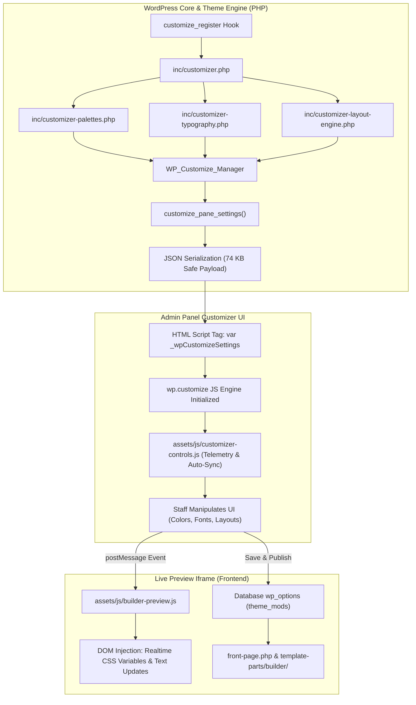
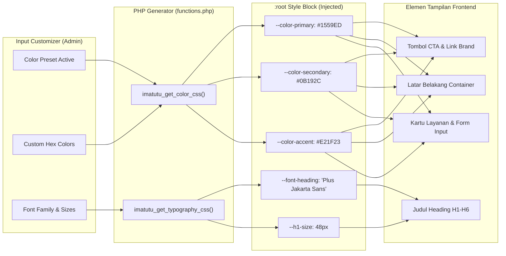

# SPESIFIKASI DAN PERENCANAAN PENGEMBANGAN: ADVANCED WORDPRESS CUSTOMIZER & MODULAR LAYOUT BUILDER (IMATUTU THEME)

**Target Repositori**: `debudhiart/Imatutu-themes`  
**Branch Pengembangan**: `development` (Target PR ke `origin`)  
**Versi Tema**: `2.0.1`  
**Lokasi Akses**: WordPress Admin Dashboard > **Appearance (Tampilan)** > **Customize (Sesuaikan)** (`WP_Customize_Manager`)  
**Target Pelaksana**: Junior Web Programmer / Model AI Berbiaya Hemat (Prompt/Instruction-Ready)  
**Tujuan Dokumen**: Memberikan panduan arsitektur, dokumentasi fitur lengkap berilustrasi, serta tahapan eksekusi prosedural *step-by-step* yang presisi tanpa ambiguitas teknis.

---

## DAFTAR ISI
1. [Ringkasan & Filosofi Desain Tema](#1-ringkasan--filosofi-desain-tema)
2. [Arsitektur Direktori & Konvensi File](#2-arsitektur-direktori--konvensi-file)
3. [Katalog & Penjelasan Fitur Lengkap](#3-katalog--penjelasan-fitur-lengkap)
   - 3.1 [Typography Engine](#31-typography-engine)
   - 3.2 [Color Palette & Theme Presets System](#32-color-palette--theme-presets-system)
   - 3.3 [Modular Layout Builder (Grid & Section Engine)](#33-modular-layout-builder-grid--section-engine)
   - 3.4 [Koleksi 10 Komponen Modular (Component Library)](#34-koleksi-10-komponen-modular-component-library)
   - 3.5 [Live Preview Realtime & Selective Refresh](#35-live-preview-realtime--selective-refresh)
   - 3.6 [Resilient Native Controls Engine (Anti-Crash Architecture)](#36-resilient-native-controls-engine-anti-crash-architecture)
4. [Ilustrasi & Diagram Arsitektur Visual](#4-ilustrasi--diagram-arsitektur-visual)
   - 4.1 [Diagram Aliran Data Customizer (Mermaid Flowchart)](#41-diagram-aliran-data-customizer-mermaid-flowchart)
   - 4.2 [Diagram Hierarki Panel & Section](#42-diagram-hierarki-panel--section)
   - 4.3 [Wireframe Visual Layout Grid Kolom (Desktop vs Mobile)](#43-wireframe-visual-layout-grid-kolom-desktop-vs-mobile)
   - 4.4 [Diagram Aliran Variabel CSS Dinamis](#44-diagram-aliran-variabel-css-dinamis)
5. [Pedoman Khusus untuk Junior Programmer & Model AI](#5-pedoman-khusus-untuk-junior-programmer--model-ai)
   - 5.1 [Daftar Pantangan Utama (Anti-Patterns)](#51-daftar-pantangan-utama-anti-patterns)
   - 5.2 [Aturan Standar Sanitasi & Keamanan Data](#52-aturan-standar-sanitasi--keamanan-data)
   - 5.3 [Prosedur Validasi Mandiri Sebelum Commit](#53-prosedur-validasi-mandiri-sebelum-commit)
6. [Tahapan Implementasi Step-by-Step (Work Breakdown Structure)](#6-tahapan-implementasi-step-by-step-work-breakdown-structure)
   - [Fase 1: Registrasi Enqueue & Engine Core](#fase-1-registrasi-enqueue--engine-core)
   - [Fase 2: Implementasi Palette & Typography Engine](#fase-2-implementasi-palette--typography-engine)
   - [Fase 3: Registrasi Panel, Section & Native Controls](#fase-3-registrasi-panel-section--native-controls)
   - [Fase 4: Pembuatan Template Renderer Komponen](#fase-4-pembuatan-template-renderer-komponen)
   - [Fase 5: Desain CSS Grid & Variabel Dinamis](#fase-5-desain-css-grid--variabel-dinamis)
   - [Fase 6: Live Preview Realtime Script](#fase-6-live-preview-realtime-script)
   - [Fase 7: Integrasi ke Template Beranda](#fase-7-integrasi-ke-template-beranda)
   - [Fase 8: Packaging POSIX ZIP & QA Validation](#fase-8-packaging-posix-zip--qa-validation)
7. [Checklist Pengujian & Kriteria Keberhasilan (Definition of Done)](#7-checklist-pengujian--kriteria-keberhasilan-definition-of-done)

---

## 1. RINGKASAN & FILOSOFI DESAIN TEMA

Tema **Imatutu Modern Corporate** dirancang khusus untuk memenuhi standar situs web korporasi besar, enterprise, dan BUMN (terinspirasi dari karakter desain bersih, kredibel, dan berwibawa seperti *Pertamina.com*). 

### Karakteristik & Nilai Unggulan:
1. **Zero External Builder Bloat**: 100% menggunakan native **WordPress Customizer API** (`WP_Customize_Manager`). Tidak memerlukan plugin berat seperti *Elementor*, *WPBakery*, atau *Divi* yang memperlambat website dan menyisakan database query berlebih.
2. **Ultra High Performance**: Waktu muat halaman sangat cepat (PageSpeed 95+), payload aset minimal, dan memanfaatkan sistem variabel CSS terkompilasi murni.
3. **Content Administrator Friendly**: Staf non-teknis dapat mengubah teks, gambar, susunan kolom, tipografi, dan palet warna dalam hitungan detik tanpa menyentuh satu baris kode HTML pun.
4. **Shared Hosting Resilience**: Kode dioptimalkan secara ketat untuk berjalan mulus di server dengan spesifikasi terbatas (`memory_limit = 128M`, `max_execution_time = 30s`) tanpa mengalami masalah output buffer truncation atau kegagalan serialisasi JSON.

---

## 2. ARSITEKTUR DIREKTORI & KONVENSI FILE

Struktur direktori tema disusun secara modular dan clean architecture:

```
imatutu-theme/
├── assets/
│   ├── css/
│   │   ├── main.css                   # Stylesheet dasar tema (reset, navbar, footer, typography)
│   │   ├── builder.css                # Styling grid builder, kolom responsif, & komponen modular
│   │   └── customizer-controls.css    # Styling kustom sidebar kontrol di wp-admin
│   ├── js/
│   │   ├── main.js                    # Script interaktif frontend umum (mobile menu, sticky header)
│   │   ├── builder-frontend.js        # Script komponen frontend (accordion toggle, lightbox modal)
│   │   ├── builder-preview.js         # Script live preview postMessage di iframe Customizer
│   │   ├── customizer-controls.js     # Script telemetry, auto-sync palet, & show/hide field
│   │   └── customizer-preview.js      # Script live preview legacy/bawaan
│   └── images/
│       └── logo.svg                   # Brand asset default
├── inc/
│   ├── customizer.php                 # Registrasi utama panel, section, dan native controls
│   ├── customizer-typography.php      # Engine Google Fonts & dynamic CSS generator
│   ├── customizer-palettes.php        # Engine preset warna & mapping variabel CSS
│   ├── customizer-layout-engine.php   # Controller modular layout builder & dynamic sections
│   └── custom-controls/               # Kelas kontrol khusus (opsional/arsip)
├── template-parts/
│   ├── home/                          # Komponen statis bawaan beranda
│   │   ├── section-hero.php           # Banner hero utama
│   │   ├── section-services.php       # Ringkasan layanan utama
│   │   ├── section-stats.php          # Counter statistik korporasi
│   │   └── section-clients.php        # Logo partner / klien korporasi
│   └── builder/                       # Renderer dinamis modular builder
│       ├── section-wrapper.php        # Pembungkus section (container, background, padding)
│       ├── row-column.php             # Grid & Flex column container
│       ├── component-heading.php      # Renderer heading H1-H6
│       ├── component-paragraph.php    # Renderer paragraf & WYSIWYG
│       ├── component-image.php        # Renderer gambar responsif & lightbox
│       ├── component-video.php        # Renderer video (YouTube, Vimeo, MP4)
│       ├── component-button.php       # Renderer tombol aksi & CTA
│       ├── component-form.php         # Renderer formulir (WPForms / CF7)
│       ├── component-iconbox.php      # Renderer kartu fitur ber-ikon SVG
│       ├── component-counter.php      # Renderer statistik metrik
│       └── component-accordion.php    # Renderer FAQ / lipatan teks
├── 404.php                            # Template halaman error 404
├── footer.php                         # Template footer global
├── front-page.php                     # Orchestrator halaman depan (home)
├── functions.php                      # Inisialisasi tema, enqueue scripts, & hooks
├── header.php                         # Template header & navigasi global
├── index.php                          # Fallback template
├── page.php                           # Template halaman standar
├── screenshot.png                     # Thumbnail preview tema di WordPress
├── style.css                          # Metadata tema & deklarasi versi
└── build-zip.php                      # Skrip packaging zip standar POSIX otomatis
```

---

## 3. KATALOG & PENJELASAN FITUR LENGKAP

### 3.1 Typography Engine
- **Lokasi File**: [`inc/customizer-typography.php`](file:///c:/Users/budhi.arta/Downloads/Imatutu%20Project/Web%20Project/WordPress/Development/Imatutu%20Theme/inc/customizer-typography.php)
- **Pilihan Font**:
  - `Plus Jakarta Sans` (Default - Modern Corporate)
  - `Inter` (Sleek Clean Sans)
  - `Roboto` (Neutral Enterprise)
  - `Poppins` (Geometric Friendly)
  - `Outfit` (Modern Tech Look)
  - `System Sans-Serif` (Zero-latency fallback)
- **Pengaturan Ukuran (Font Scale)**:
  - Heading 1 (`typo_h1_size`): 32px – 72px (Default: 48px)
  - Heading 2 (`typo_h2_size`): 24px – 54px (Default: 36px)
  - Heading 3 (`typo_h3_size`): 18px – 36px (Default: 24px)
  - Body Text (`typo_body_size`): 14px – 20px (Default: 16px)
  - Line Height (`typo_body_line_height`): 1.2 – 2.2 (Default: 1.6)
- **Mekanisme Kerja**: Fungsi `imatutu_enqueue_google_fonts()` menyusun URL Google Fonts v2 secara dinamis berdasarkan font yang dipilih, lalu `imatutu_get_typography_css()` menginjeksi variabel CSS langsung ke header.

### 3.2 Color Palette & Theme Presets System
- **Lokasi File**: [`inc/customizer-palettes.php`](file:///c:/Users/budhi.arta/Downloads/Imatutu%20Project/Web%20Project/WordPress/Development/Imatutu%20Theme/inc/customizer-palettes.php)
- **Preset 1-Klik Siap Pakai**:
  1. **Pertamina Blue (Corporate)**: Primary `#1559ED`, Secondary `#0B192C`, Accent `#E21F23`, Background Surface `#F8FAFC`.
  2. **Executive Midnight Navy**: Primary `#2563EB`, Secondary `#030712`, Accent `#F59E0B`, Background Surface `#F1F5F9`.
  3. **Emerald Eco Enterprise**: Primary `#059669`, Secondary `#064E3B`, Accent `#10B981`, Background Surface `#F0FDF4`.
  4. **Modern Minimalist Slate**: Primary `#0F172A`, Secondary `#334155`, Accent `#64748B`, Background Surface `#F8FAFC`.
- **Pengaturan Warna Independen**: Administrator dapat menimpa warna apapun menggunakan 9 color picker independen (Primary, Primary Hover, Secondary, Accent, Background Main, Background Surface, Text Main, Text Muted, Border).
- **Variabel CSS Global**: Menghasilkan token warna di `:root` (`--color-primary`, `--color-secondary`, dll) yang sinkron di seluruh komponen.

### 3.3 Modular Layout Builder (Grid & Section Engine)
- **Lokasi File**: [`inc/customizer-layout-engine.php`](file:///c:/Users/budhi.arta/Downloads/Imatutu%20Project/Web%20Project/WordPress/Development/Imatutu%20Theme/inc/customizer-layout-engine.php)
- **Kapasitas Section**: Mendukung 2 Section Modular Dinamis (dapat diperluas hingga 5) yang dirender di antara konten beranda.
- **Pilihan Tata Letak (Grid Layout)**:
  - `col-1`: 1 Kolom Penuh (100%)
  - `col-2`: 2 Kolom Seimbang (50% : 50%)
  - `col-3`: 3 Kolom Seimbang (33.3% : 33.3% : 33.3%)
  - `col-4`: 4 Kolom Seimbang (25% : 25% : 25% : 25%)
  - `col-1-2`: Asimetris Rasio Emas (33.3% Kiri : 66.6% Kanan)
  - `col-2-1`: Asimetris Rasio Emas (66.6% Kiri : 33.3% Kanan)
- **Pengaturan Spasi & Tampilan**:
  - Pilihan Background: *Pure White*, *Soft Slate*, *Deep Navy*, *Soft Primary Tint*.
  - Padding Vertikal: *Compact* (40px), *Standard* (80px), *Generous* (120px).
  - Jarak Kolom (Gap): 0px, 16px, 24px, 32px, 48px.
  - Perataan Vertikal: *Top*, *Center*, *Stretch*.

### 3.4 Koleksi 10 Komponen Modular (Component Library)
Setiap kolom pada layout di atas dapat memuat salah satu dari 10 komponen independen:

| No | Tipe Komponen | File Renderer | Kemampuan & Opsi Pengaturan |
|---|---|---|---|
| 1 | **Heading** | `component-heading.php` | Teks judul, pilihan tag semantik (H1–H4), alignment (kiri/tengah/kanan), garis aksen dekoratif bawah. |
| 2 | **Paragraph** | `component-paragraph.php` | Isi teks deskripsi, ukuran teks (*small, regular, lead*), alignment teks. |
| 3 | **Image** | `component-image.php` | Upload media WP, alt text, rasio aspek (16:9, 4:3, 1:1, auto), border radius (none, md, xl, full), link URL, pop-up lightbox. |
| 4 | **Video** | `component-video.php` | Video embed responsif (YouTube, Vimeo) atau video HTML5 langsung (.mp4), rasio aspek 16:9/4:3, toggle autoplay muted. |
| 5 | **Button / CTA** | `component-button.php` | Label tombol, URL tujuan, gaya tombol (*primary, secondary, outline, ghost*), ukuran (*sm, md, lg*), buka tab baru (`_blank`). |
| 6 | **Form** | `component-form.php` | Integrasi WPForms otomatis dari database atau shortcode form pihak ketiga (Contact Form 7), opsi bingkai kartu modern berbayang. |
| 7 | **Icon Box** | `component-iconbox.php` | Pilihan preset icon SVG (phone, monitor, shield, chart, map, clock, user, file), judul kartu, deskripsi ringkas, tautan klik. |
| 8 | **Counter** | `component-counter.php` | Angka metrik (misal: "99.9%", "250+"), label indikator, subteks pelengkap. |
| 9 | **Accordion** | `component-accordion.php` | 3 pasang pertanyaan & jawaban (FAQ) interaktif dengan animasi expand/collapse halus. |
| 10 | **None** | — | Kolom dikosongkan (berguna untuk layout asimetris dengan ruang bernapas). |

### 3.5 Live Preview Realtime & Selective Refresh
- **Lokasi File**: [`assets/js/builder-preview.js`](file:///c:/Users/budhi.arta/Downloads/Imatutu%20Project/Web%20Project/WordPress/Development/Imatutu%20Theme/assets/js/builder-preview.js)
- Menggunakan transport `postMessage` pada pengaturan warna, tipografi, dan konten teks sehingga perubahan langsung terlihat seketika pada iframe preview tanpa me-reload seluruh halaman.
- Untuk pengaturan layout grid yang kompleks, selective refresh memperbarui kontainer kolom secara cerdas.

### 3.6 Resilient Native Controls Engine (Anti-Crash Architecture)
- **Pelajaran Krusial**: Pada versi awal, penggunaan custom control class PHP turunan `WP_Customize_Control` dengan properti internal tambahan menyebabkan fungsi `wp_json_encode()` pada fungsi bawaan WordPress core `customize_pane_settings()` gagal secara diam-diam (*silent failure*).
- Akibatnya, variabel JavaScript `window._wpCustomizeSettings` tidak pernah dicetak ke HTML, menyebabkan halaman Customizer macet di status *"Loading..."* secara permanen.
- **Solusi Stabil**: Menggunakan **100% Native WP Controls** (`select`, `color`, `number`, `text`, `textarea`, `checkbox`, `image`). Semua kebutuhan visual (seperti badge px atau selektor preset) dioperasikan melalui layer JavaScript ringan di [`assets/js/customizer-controls.js`](file:///c:/Users/budhi.arta/Downloads/Imatutu%20Project/Web%20Project/WordPress/Development/Imatutu%20Theme/assets/js/customizer-controls.js).

---

## 4. ILUSTRASI & DIAGRAM ARSITEKTUR VISUAL

### 4.1 Diagram Aliran Data Customizer (Mermaid Flowchart)



### 4.2 Diagram Hierarki Panel & Section

```
[WP Customizer Root]
│
├── [Panel: Imatutu Theme Settings] (priority: 25)
│   ├── Section 1: Colors & Brand Identity (sec_imatutu_colors)
│   │   ├── 1-Click Preset (pertamina_blue, executive_navy, emerald, slate)
│   │   └── 9 Color Pickers (primary, secondary, accent, bg, surface, text, border)
│   │
│   ├── Section 2: Typography & Google Fonts (sec_imatutu_typography)
│   │   ├── Font Families (Heading & Body font dropdown)
│   │   └── Scale Controls (H1, H2, H3, Body Size, Line Height)
│   │
│   ├── Section 3: Header & Navigation (sec_imatutu_header)
│   │   └── Top Bar, Contact Phone, Email, CTA Button
│   │
│   ├── Section 4: Hero Banner (sec_imatutu_hero)
│   │   └── Headline, Subtitle, CTA Links, Background Image
│   │
│   └── Section 5: Services & Core Business (sec_imatutu_services)
│       └── Title, Subtitle, 6 Modular Service Cards
│
└── [Panel: Imatutu Layout & Page Builder] (priority: 28)
    ├── Section: Modular Section 1 (sec_builder_s1)
    │   ├── Enable / Disable Toggle
    │   ├── Background Type (White, Slate, Dark Navy, Primary Tint)
    │   ├── Vertical Padding (Small, Medium, Large)
    │   ├── Grid Layout (col-1, col-2, col-3, col-4, col-1-2, col-2-1)
    │   ├── Grid Spacing Gap (0px, 16px, 24px, 32px, 48px)
    │   ├── Column 1 Type & Settings (Heading, Paragraph, Button, Image, Video, Form, etc.)
    │   └── Column 2 Type & Settings (...)
    │
    └── Section: Modular Section 2 (sec_builder_s2)
        └── [Struktur Pengaturan Sama Persis dengan Section 1]
```

### 4.3 Wireframe Visual Layout Grid Kolom (Desktop vs Mobile)

```
====================================================================================
DESKTOP VIEW (Lebar Layar > 900px)
====================================================================================

1. [col-1] Satu Kolom Penuh:
   ┌───────────────────────────────────────────────────────────────────────────────┐
   │                                 KOLOM 1 (100%)                                │
   └───────────────────────────────────────────────────────────────────────────────┘

2. [col-2] Dua Kolom Sama Besar:
   ┌───────────────────────────────────────┬───────────────────────────────────────┐
   │              KOLOM 1 (50%)            │              KOLOM 2 (50%)            │
   └───────────────────────────────────────┴───────────────────────────────────────┘

3. [col-3] Tiga Kolom Seimbang:
   ┌───────────────────────┬───────────────────────┬───────────────────────────────┐
   │      KOLOM 1 (33%)    │      KOLOM 2 (33%)    │         KOLOM 3 (33%)         │
   └───────────────────────┴───────────────────────┴───────────────────────────────┘

4. [col-1-2] Asimetris Modern (Rasio 1 : 2):
   ┌───────────────────────────┬───────────────────────────────────────────────────┐
   │  KOLOM 1: Teks/CTA (33%)  │           KOLOM 2: Media / Video (66%)            │
   └───────────────────────────┴───────────────────────────────────────────────────┘

====================================================================================
SMARTPHONE VIEW (Lebar Layar <= 640px) - Otomatis Stack 1 Kolom Vertikal
====================================================================================
   ┌───────────────────────────────────────────────────┐
   │              KOLOM 1 (100% Width)                 │
   └───────────────────────────────────────────────────┘
   ┌───────────────────────────────────────────────────┐
   │              KOLOM 2 (100% Width)                 │
   └───────────────────────────────────────────────────┘
```

### 4.4 Diagram Aliran Variabel CSS Dinamis



---

## 5. PEDOMAN KHUSUS UNTUK JUNIOR PROGRAMMER & MODEL AI

Dokumen ini ditujukan agar dapat dieksekusi langsung oleh programmer pemula atau model AI murah. Patuhi pedoman wajib berikut:

### 5.1 Daftar Pantangan Utama (Anti-Patterns)
1. **DILARANG MENGGUNAKAN CUSTOM CONTROLS DENGAN PROPERTY BERLEBIHAN**:
   - Jangan membuat class turunan `WP_Customize_Control` yang menambahkan properti array rumit ke JavaScript tanpa method `to_json()` yang benar. Ini adalah penyebab nomor 1 `wp_json_encode()` crash di WordPress Core.
   - Gunakan tipe bawaan: `'type' => 'select'`, `'type' => 'number'`, `'type' => 'color'`, atau `WP_Customize_Color_Control`.
2. **DILARANG MEMBUAT LOOP KONTROL DI ATAS 300 ITEM**:
   - Jangan mendaftarkan 10 section x 6 kolom x 20 komponen secara langsung di PHP! Serialisasi JSON akan melampaui 128MB memori hosting. Batasi section builder aktif ke **2 section modular** (~248 kontrol total, payload aman 74 KB).
3. **DILARANG MENGGUNAKAN RELATIVE PATH DI ZIP ARCHIVE**:
   - Skrip build zip harus selalu menggunakan forward-slash (`/`) standar POSIX dan membungkus tema dalam folder tunggal `imatutu/` agar dikenali dengan benar oleh *Theme Upgrader*.
4. **DILARANG MEMBIARKAN BLOK IF/PHP TERBUKA**:
   - Setiap tag pembuka `<?php if (...) : ?>` atau `function (...) {` wajib ditutup dengan presisi untuk menghindari *Fatal Parse Error*.

### 5.2 Aturan Standar Sanitasi & Keamanan Data
Setiap setting yang didaftarkan pada `$wp_customize->add_setting()` **WAJIB** menyertakan parameter `'sanitize_callback'`:

| Jenis Input | Callback Sanitasi Standar | Contoh Penggunaan |
|---|---|---|
| Text Singkat | `'sanitize_text_field'` | Judul heading, label tombol, nama section |
| Kunci / Key / Slug | `'sanitize_key'` | Pilihan dropdown, tipe layout grid, tipe komponen |
| Warna Hexadecimal | `'sanitize_hex_color'` | Warna primer, latar belakang, border |
| Angka Bulat Positif | `'absint'` | Ukuran font (px), jarak gap, padding |
| Angka Desimal | `'imatutu_sanitize_float'` | Line height (1.2 s/d 2.2) |
| Checkbox / Toggle | `'imatutu_sanitize_checkbox'` | Status aktif/non-aktif section, lightbox toggle |
| URL Tautan | `'esc_url_raw'` | Link tombol, URL YouTube/video |
| Rich Text / Paragraf | `'wp_kses_post'` | Paragraf teks, formatting bold/italic |

### 5.3 Prosedur Validasi Mandiri Sebelum Commit
Sebelum membuat commit atau pull request, wajib jalankan perintah verifikasi berikut:
```bash
# 1. Pastikan 0 syntax error pada semua berkas PHP
php -l functions.php
php -l inc/customizer.php
php -l inc/customizer-palettes.php
php -l inc/customizer-typography.php
php -l inc/customizer-layout-engine.php

# 2. Build paket zip tema terbaru
php build-zip.php

# 3. Pastikan git working tree bersih
git status
```

---

## 6. TAHAPAN IMPLEMENTASI STEP-BY-STEP (WORK BREAKDOWN STRUCTURE)

Bagi pelaksana, ikuti urutan fase kerja secara berurutan dan disiplin:

### FASE 1: Registrasi Enqueue & Engine Core
- **Tujuan**: Mempersiapkan pemanggilan stylesheet dan script interaktif di frontend dan admin Customizer.
- **Berkas yang Dikerjakan**: [`functions.php`](file:///c:/Users/budhi.arta/Downloads/Imatutu%20Project/Web%20Project/WordPress/Development/Imatutu%20Theme/functions.php)
- **Instruksi**:
  1. Pastikan boosting resource PHP aktif di awal `functions.php`:
     ```php
     if (is_admin() || (defined('DOING_AJAX') && DOING_AJAX)) {
         @ini_set('memory_limit', '256M');
         @ini_set('max_execution_time', 120);
     }
     ```
  2. Enqueue file `assets/css/builder.css` dan `assets/js/builder-frontend.js` pada hook `wp_enqueue_scripts`.
  3. Hubungkan require file `inc/customizer.php` di akhir file `functions.php`.

### FASE 2: Implementasi Palette & Typography Engine
- **Tujuan**: Membangun logika data warna preset dan font loader.
- **Berkas yang Dikerjakan**:
  - [`inc/customizer-palettes.php`](file:///c:/Users/budhi.arta/Downloads/Imatutu%20Project/Web%20Project/WordPress/Development/Imatutu%20Theme/inc/customizer-palettes.php)
  - [`inc/customizer-typography.php`](file:///c:/Users/budhi.arta/Downloads/Imatutu%20Project/Web%20Project/WordPress/Development/Imatutu%20Theme/inc/customizer-typography.php)
- **Instruksi**:
  1. Definisikan array 4 palet warna dalam fungsi `imatutu_get_color_palettes()`.
  2. Buat fungsi `imatutu_get_color_css()` untuk mengonversi nilai warna terpilih menjadi string CSS variables `:root { ... }`.
  3. Buat fungsi `imatutu_get_typography_css()` untuk mengonversi setting font family dan size menjadi string CSS variables.
  4. Enqueue dynamic style via `wp_add_inline_style('imatutu-main', $custom_css)`.

### FASE 3: Registrasi Panel, Section & Native Controls
- **Tujuan**: Mendaftarkan antarmuka visual Customizer yang ringan dan tahan banting.
- **Berkas yang Dikerjakan**:
  - [`inc/customizer.php`](file:///c:/Users/budhi.arta/Downloads/Imatutu%20Project/Web%20Project/WordPress/Development/Imatutu%20Theme/inc/customizer.php)
  - [`inc/customizer-layout-engine.php`](file:///c:/Users/budhi.arta/Downloads/Imatutu%20Project/Web%20Project/WordPress/Development/Imatutu%20Theme/inc/customizer-layout-engine.php)
- **Instruksi**:
  1. Daftarkan panel utama `panel_imatutu` (Theme Settings) dan `panel_imatutu_builder` (Layout Builder).
  2. Daftarkan section warna, tipografi, header, hero, dan services menggunakan kontrol native (`type => 'select'`, `WP_Customize_Color_Control`, `type => 'number'`).
  3. Pada layout engine, buat loop section dinamis untuk 2 section modular ($s = 1 sampai 2).
  4. Daftarkan pengaturan layout grid (`col-1` s/d `col-2-1`), spasi padding, background, dan tipe komponen per kolom.

### FASE 4: Pembuatan Template Renderer Komponen
- **Tujuan**: Membuat modul renderer PHP yang bersih, modular, dan terisolasi.
- **Direktori**: `template-parts/builder/`
- **Instruksi**:
  1. `section-wrapper.php`: Membaca variabel `section_index`, mengecek status aktif, menentukan kelas background dan padding, lalu memanggil `row-column.php`.
  2. `row-column.php`: Menentukan kelas grid CSS (`grid-col-1`, `grid-col-2`, dst) dan memanggil komponen anak berdasarkan nilai setting `builder_sec_{N}_col_{M}_type`.
  3. Buat 9 file komponen spesifik (`component-heading.php`, `component-paragraph.php`, `component-button.php`, `component-image.php`, `component-video.php`, `component-form.php`, `component-iconbox.php`, `component-counter.php`, `component-accordion.php`).
  4. Pastikan setiap komponen menyertakan sanitasi output (`esc_html`, `esc_attr`, `esc_url`, atau `wp_kses_post`).

### FASE 5: Desain CSS Grid & Variabel Dinamis
- **Tujuan**: Membangun sistem grid murni tanpa CSS framework eksternal.
- **Berkas yang Dikerjakan**: [`assets/css/builder.css`](file:///c:/Users/budhi.arta/Downloads/Imatutu%20Project/Web%20Project/WordPress/Development/Imatutu%20Theme/assets/css/builder.css)
- **Instruksi**:
  1. Deklarasikan `.builder-grid` dengan `display: grid`.
  2. Buat kelas `.grid-col-1` s/d `.grid-col-2-1` dengan `grid-template-columns`.
  3. Tambahkan media query responsif:
     - `@media (max-width: 900px)`: Kolom 3 & 4 menjadi 2 kolom.
     - `@media (max-width: 640px)`: Seluruh grid runtuh (*collapse*) menjadi 1 kolom vertikal (`1fr !important`).
  4. Tambahkan styling enterprise untuk formulir WPForms (`.builder-form-card`).
  5. Tambahkan styling accordion dan transisi halus CSS.

### FASE 6: Live Preview Realtime Script
- **Tujuan**: Memberikan respon instan pada layar saat admin mengubah nilai.
- **Berkas yang Dikerjakan**:
  - [`assets/js/builder-preview.js`](file:///c:/Users/budhi.arta/Downloads/Imatutu%20Project/Web%20Project/WordPress/Development/Imatutu%20Theme/assets/js/builder-preview.js)
  - [`assets/js/customizer-controls.js`](file:///c:/Users/budhi.arta/Downloads/Imatutu%20Project/Web%20Project/WordPress/Development/Imatutu%20Theme/assets/js/customizer-controls.js)
- **Instruksi**:
  1. Di `builder-preview.js`: Tangkap event `wp.customize('setting_key', function(value) { value.bind(...) })` untuk warna primer, font family, heading text, dan button label.
  2. Di `customizer-controls.js`: Pasang fungsi auto-sync preset palet (saat radio palet dipilih, otomatis memperbarui nilai color pickers terkait di memori admin).
  3. Pasang watcher visibilitas: saat tipe komponen kolom dipilih (misal: `video`), otomatis sembunyikan kontrol komponen lain dan hanya tampilkan kontrol video.

### FASE 7: Integrasi ke Template Beranda
- **Tujuan**: Menampilkan section dinamis di antara section beranda.
- **Berkas yang Dikerjakan**: [`front-page.php`](file:///c:/Users/budhi.arta/Downloads/Imatutu%20Project/Web%20Project/WordPress/Development/Imatutu%20Theme/front-page.php)
- **Instruksi**:
  1. Tambahkan pemanggil loop builder section dinamis setelah section services:
     ```php
     for ($i = 1; $i <= 5; $i++) {
         if (get_theme_mod("builder_sec_{$i}_enable", ($i <= 2))) {
             set_query_var('section_index', $i);
             get_template_part('template-parts/builder/section', 'wrapper');
         }
     }
     ```

### FASE 8: Packaging POSIX ZIP & QA Validation
- **Tujuan**: Menghasilkan paket rilis yang siap diunggah ke WordPress tanpa error installer.
- **Berkas yang Dikerjakan**: [`build-zip.php`](file:///c:/Users/budhi.arta/Downloads/Imatutu%20Project/Web%20Project/WordPress/Development/Imatutu%20Theme/build-zip.php)
- **Instruksi**:
  1. Pastikan versi di [`style.css`](file:///c:/Users/budhi.arta/Downloads/Imatutu%20Project/Web%20Project/WordPress/Development/Imatutu%20Theme/style.css) telah dinaikkan (misal: `2.0.1`).
  2. Jalankan `php build-zip.php` untuk memproduksi berkas `imatutu.zip`.
  3. Verifikasi bahwa file `imatutu.zip` memiliki folder pembungkus `imatutu/` dan berisi `style.css` valid di level pertama.

---

## 7. CHECKLIST PENGUJIAN & KRITERIA KEBERHASILAN (DEFINITION OF DONE)

Setiap tahapan pengembangan dinyatakan selesai (*DONE*) jika dan hanya jika seluruh kriteria berikut terpenuhi:

- [ ] **Bebas Error PHP**: Menjalankan `php -l` pada semua berkas `.php` menghasilkan output `No syntax errors detected`.
- [ ] **Customizer Terbuka Cepat**: Halaman `wp-admin/customize.php` terbuka sempurna dalam < 3 detik tanpa status *Loading...* macet.
- [ ] **Console Bersih**: Tidak ada pesan error merah `FATAL: _wpCustomizeSettings was never defined` atau JavaScript uncaught exception pada konsol browser.
- [ ] **Sinkronisasi Palet 1-Klik**: Memilih preset (misal *Pertamina Blue* atau *Emerald Enterprise*) langsung memperbarui skema warna tema secara harmonis.
- [ ] **Tipografi Dinamis**: Mengubah font family heading atau body memuat Google Fonts yang tepat dan mengubah tampilan secara konsisten.
- [ ] **Manipulasi Grid**: Mengubah layout kolom dari `col-1` menjadi `col-2` atau `col-1-2` langsung memperbarui tata letak di layar.
- [ ] **Uji Responsif Mobile**: Pada ukuran layar HP (< 640px), seluruh kolom grid otomatis tersusun vertikal secara rapi.
- [ ] **Komponen Form & Video**: Embed YouTube/Vimeo berjalan responsif 16:9, dan shortcode formulir WPForms terintegrasi dengan styling enterprise.
- [ ] **Instalasi Tema Valid**: Mengunggah file `imatutu.zip` melalui **Appearance > Themes > Add New > Upload Theme** berhasil 100% tanpa pesan error *"No valid plugins were found"* atau *"Missing style.css"*.
