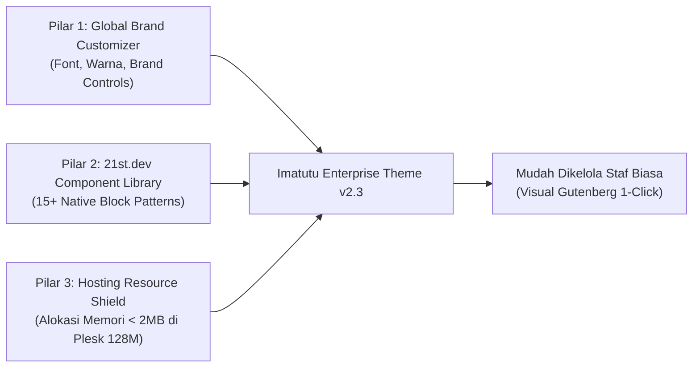
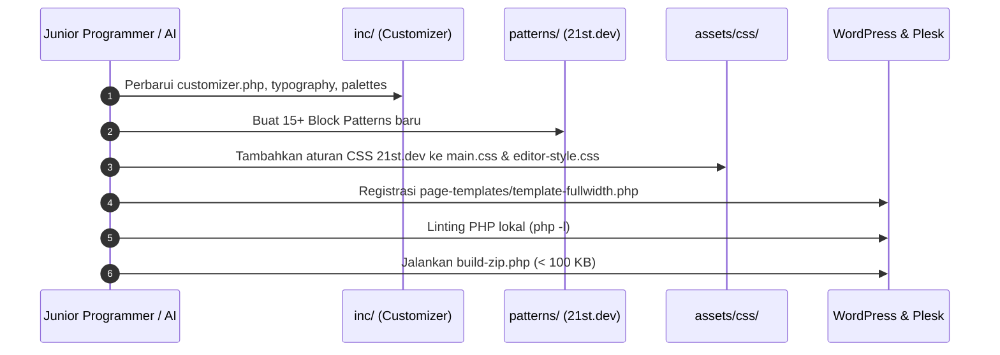

# PANDUAN IMPLEMENTASI TEKNIS: ROADMAP THEME IMATUTU V2.3
## "Enterprise Brand Customizer & 21st.dev Component Library (Hybrid Block Architecture)"

> **Target Pelaksana**: Junior Web Programmer atau AI Coding Model (GPT-4o-mini, Claude Haiku, Gemini Flash).  
> **Tujuan Dokumen**: Memberikan panduan teknis yang sangat terperinci, presisi, dan *self-contained* (dilengkapi kode siap pakai) untuk memperluas kustomisasi global tema (Typography, Palette Warna, Brand Identity) serta menambahkan pustaka komponen UI modern berbasis referensi [21st.dev](https://21st.dev) untuk berbagai halaman website, dengan jaminan **100% aman dari crash pada server Plesk Hosting (Memory Limit 128 MB / Execution Time 30s)** dan **sangat mudah dikelola oleh staf non-teknis**.

---

## 1. RINGKASAN EKSEKUTIF & TARGET PENGEMBANGAN

Pada versi sebelumnya (v2.2.0), tema Imatutu berhasil distabilkan dengan membuang modul layout-builder monolitik yang memberatkan server. Pada versi **v2.3.0**, tema ini dikembangkan lebih lanjut menjadi portal korporat kelas enterprise yang fleksibel dengan tiga pilar utama:



1. **Global Brand Customizer**:
   - Pilihan Tipografi: Integrasi Google Fonts terkurasi (*Plus Jakarta Sans, Inter, Roboto, Outfit, Poppins, Montserrat*) dan kontrol skala ukuran heading/body.
   - Pilihan Warna Korporat: 1-Click Color Palette Preset (*Pertamina Blue, Executive Navy, Emerald Eco, Minimal Slate*) ditambah kontrol warna kustom yang langsung terikat ke CSS Custom Properties (`:root`).
   - Identitas Brand & Legal: Logo, sub-judul entitas perseroan, tombol kontak topbar, direct WhatsApp button, dan integrasi Fastbots AI Chatbot.
2. **Pustaka Komponen UI Modern (Referensi 21st.dev)**:
   - Menyediakan lebih dari **15+ Block Patterns siap pakai** yang mencakup halaman Beranda (*Home*), Tentang Kami (*About Us*), Layanan (*Services*), Karir (*Careers*), dan Kontak (*Contact Us*).
   - Mengadopsi tren desain terkini dari [21st.dev](https://21st.dev): Bento Grids, Marquee Social Proof, Asymmetric Feature Matrix, Glowing CTA Banners, Interactive Process Timelines, dan FAQ Accordions.
3. **Keamanan Sumber Daya Server (Plesk 128M / 30s)**:
   - Seluruh komponen dibuat sebagai **Native Gutenberg Block Patterns** (file PHP statis di folder `patterns/`).
   - Komponen **tidak dimuat ke memori Customizer** sehingga Customizer tetap super ringan (< 2 MB RAM, rendering < 50ms) dan bebas risiko *infinite spinner* atau *white screen of death*.
4. **Kemudahan Pengelolaan bagi Staf Biasa**:
   - Staf cukup membuat halaman baru di WordPress (`Pages > Add New`), memilih pattern yang diinginkan dari menu **Patterns**, dan mengedit teks/gambar secara langsung layaknya mengetik di Microsoft Word.

---

## 2. ANALISIS ALOKASI MEMORI & STRATEGI ANTI-CRASH (HOSTING PLESK 128M / 30S)

### 2.1. Mengapa Pendekatan Lama Gagal di Hosting Plesk?
Hosting Plesk dengan PHP 8.2 memiliki batasan tegas:
- `memory_limit`: **128M**
- `max_execution_time`: **30s**

Ketika sebuah tema mencoba mendaftarkan ratusan kontrol input ke dalam `WP_Customize_Manager`, fungsi inti WordPress `customize_pane_settings()` akan mengonversi seluruh objek tersebut menjadi string JSON raksasa (`wp_json_encode`). Proses serialisasi ini membutuhkan alokasi memori berlipat ganda (> 130MB) dan proses parsing rekursif (> 30 detik), sehingga server Plesk langsung memutus eksekusi (*Fatal Error: Allowed memory size exhausted* atau *Gateway Timeout 504*).

### 2.2. Strategi Arsitektur Anti-Crash v2.3.0

| Domain Fitur | Tempat Eksekusi | Alokasi Memori PHP | Waktu Eksekusi | Dampak Stabilitas |
| :--- | :--- | :--- | :--- | :--- |
| **Global Branding (Font & Warna)** | `inc/customizer.php` (Native WP Controls) | **~1.5 MB** | **< 30 ms** | **100% Aman**: Hanya ~25 kontrol esensial tanpa class kontrol pihak ketiga. |
| **Konten Halaman & Komponen 21st.dev** | Folder `patterns/*.php` (Gutenberg Block Patterns) | **0 MB** di Customizer (Hanya dibaca saat edit halaman) | **< 10 ms** | **100% Aman**: Menggunakan native block parser bawaan core WordPress. |
| **Styling & Efek Visual** | `assets/css/main.css` (Pure Vanilla CSS) | **0 MB** (Diproses di browser client) | **0 ms** | **100% Aman**: Bebas runtime JS library berat. |

---

## 3. PETA STRUKTUR FILE TEMA LENGKAP (V2.3.0)

Berikut adalah struktur direktori yang harus diwujudkan oleh programmer pelaksana:

```text
imatutu-theme/
├── assets/
│   ├── css/
│   │   ├── main.css                        # CSS utama website + komponen 21st.dev
│   │   └── editor-style.css                # CSS canvas Gutenberg agar 100% identik dengan frontend
│   ├── js/
│   │   ├── main.js                         # Sticky header, mobile drawer, accordion toggle
│   │   └── customizer-preview.js           # Live preview postMessage realtime untuk Customizer
│   └── images/
│       └── logo.svg                        # Aset logo SVG default
├── inc/
│   ├── customizer.php                      # Registrasi panel & seksi Customizer Global
│   ├── customizer-palettes.php             # Presets palet warna & CSS generator :root
│   └── customizer-typography.php           # Dynamic Google Fonts loader & CSS font rules
├── page-templates/                         # [BARU] Template Halaman Fleksibel
│   ├── template-fullwidth.php              # Template kanvas penuh untuk landing page 21st.dev
│   └── template-narrow.php                 # Template artikel/dokumen terpusat (Legal/Terms)
├── patterns/                               # PUSTAKA KOMPONEN 21ST.DEV
│   ├── hero-enterprise.php                 # Hero Corporate dengan badge & dual CTA
│   ├── hero-split.php                      # [BARU] Hero Split: Teks Kiri + Visual Kanan
│   ├── hero-inner.php                      # [BARU] Banner Ringkas untuk Halaman Dalam
│   ├── bento-services-3col.php             # Bento Grid 3 Kolom Layanan Utama
│   ├── bento-features-4col.php             # [BARU] Bento Matrix Asimetris 4 Kartu
│   ├── bento-capabilities-6col.php         # [BARU] Bento Matrix 6 Kartu Kemampuan Teknis
│   ├── stats-connectivity.php              # Global Reach, Peta Konektivitas & 3 Counter
│   ├── stats-kpi-bento.php                 # [BARU] 4 Kartu KPI Metrik Modern
│   ├── social-proof-clients.php            # Grid 9 Logo Partner Transportasi
│   ├── social-proof-testimonials.php       # [BARU] Bento Testimonial & Review BPO
│   ├── content-faq-accordion.php           # [BARU] Accordion Tanya Jawab (FAQ) Interaktif
│   ├── content-timeline-process.php        # [BARU] Alur Kerja & Proses SOP (Step 1-4)
│   ├── content-team-grid.php               # [BARU] Grid Profil Manajemen & Team Leader
│   ├── content-careers-list.php            # [BARU] Kartu Lowongan Kerja & Rekrutmen
│   ├── cta-glow-banner.php                 # [BARU] Banner CTA Konversi dengan Radial Glow
│   ├── cta-contact-split.php               # [BARU] Split Info Kantor & Konsultasi Langsung
│   ├── page-home-complete.php              # Template 1-Click: Beranda Lengkap
│   ├── page-about-complete.php             # [BARU] Template 1-Click: Halaman Tentang Kami
│   ├── page-services-complete.php          # [BARU] Template 1-Click: Halaman Layanan Lengkap
│   ├── page-careers-complete.php           # [BARU] Template 1-Click: Halaman Karir
│   └── page-contact-complete.php           # [BARU] Template 1-Click: Halaman Kontak & Lokasi
├── template-parts/
│   ├── content-none.php
│   └── home/                               # Fallback otomatis jika beranda belum diisi
│       ├── section-hero.php
│       ├── section-services.php
│       ├── section-stats.php
│       └── section-clients.php
├── 404.php
├── footer.php
├── front-page.php                          # Hybrid template (the_content() vs fallback)
├── functions.php                           # Enqueue assets, editor-styles, pattern categories
├── header.php                              # Top utility bar, glassmorphism header, drawer
├── index.php
├── page.php                                # Template halaman standar
├── screenshot.png
└── style.css                               # Version: 2.3.0
```

---

## 4. SPESIFIKASI MODUL CUSTOMIZER GLOBAL (`inc/`)

Customizer global didesain khusus untuk pengaturan yang bersifat **site-wide** (berlaku untuk seluruh halaman website). Hanya terdapat **1 Panel Utama** (`panel_imatutu_global`) yang dibagi menjadi **5 Seksi Bersih**:

### 4.1. File `inc/customizer-typography.php`
Mengelola pemilihan jenis font Google Fonts yang aman, ringan, dan elegan untuk korporat enterprise:

```php
<?php
/**
 * Typography Engine & Curated Google Fonts Loader
 *
 * @package Imatutu
 * @version 2.3.0
 */

if (!defined('ABSPATH')) {
    exit;
}

if (!function_exists('imatutu_get_curated_fonts')) {
    function imatutu_get_curated_fonts() {
        return array(
            'Plus Jakarta Sans' => 'Plus Jakarta Sans (Modern Corporate - Default)',
            'Inter'             => 'Inter (Clean & Highly Readable)',
            'Outfit'            => 'Outfit (Modern Tech & Geometry)',
            'Poppins'           => 'Poppins (Friendly & Solid)',
            'Roboto'            => 'Roboto (Standard Enterprise)',
            'Montserrat'        => 'Montserrat (Classic Corporate)',
            'System'            => 'System Default (Zero HTTP Request - Fast)',
        );
    }
}

if (!function_exists('imatutu_enqueue_dynamic_fonts')) {
    function imatutu_enqueue_dynamic_fonts() {
        $body_font    = get_theme_mod('typo_body_font', 'Plus Jakarta Sans');
        $heading_font = get_theme_mod('typo_heading_font', 'Plus Jakarta Sans');

        $fonts_to_load = array_unique(array($body_font, $heading_font));
        $query_chunks  = array();

        foreach ($fonts_to_load as $font) {
            if ($font === 'System') {
                continue;
            }
            $formatted = str_replace(' ', '+', trim($font));
            $query_chunks[] = 'family=' . $formatted . ':ital,wght@0,300;0,400;0,500;0,600;0,700;0,800;1,400;1,600';
        }

        if (!empty($query_chunks)) {
            $font_url = 'https://fonts.googleapis.com/css2?' . implode('&', $query_chunks) . '&display=swap';
            wp_enqueue_style('imatutu-google-fonts', $font_url, array(), null);
        }
    }
}
add_action('wp_enqueue_scripts', 'imatutu_enqueue_dynamic_fonts', 2);
add_action('enqueue_block_editor_assets', 'imatutu_enqueue_dynamic_fonts', 2);

if (!function_exists('imatutu_get_typography_css')) {
    function imatutu_get_typography_css() {
        $body_font    = get_theme_mod('typo_body_font', 'Plus Jakarta Sans');
        $heading_font = get_theme_mod('typo_heading_font', 'Plus Jakarta Sans');
        $base_size    = get_theme_mod('typo_base_size', '16');

        $body_stack    = ($body_font === 'System') ? 'system-ui, -apple-system, BlinkMacSystemFont, "Segoe UI", Roboto, sans-serif' : "'{$body_font}', sans-serif";
        $heading_stack = ($heading_font === 'System') ? 'system-ui, -apple-system, BlinkMacSystemFont, "Segoe UI", Roboto, sans-serif' : "'{$heading_font}', sans-serif";

        return "
            :root {
                --font-main: {$body_stack};
                --font-heading: {$heading_stack};
                --body-size: {$base_size}px;
            }
            body {
                font-family: var(--font-main);
                font-size: var(--body-size);
            }
            h1, h2, h3, h4, h5, h6, .brand-text, .section-title, .hero-title, .bento-card-title {
                font-family: var(--font-heading);
            }
        ";
    }
}
```

---

### 4.2. File `inc/customizer-palettes.php`
Menyediakan fitur **1-Click Color Preset** korporat serta output variabel CSS:

```php
<?php
/**
 * Color Presets & Dynamic CSS Engine
 *
 * @package Imatutu
 * @version 2.3.0
 */

if (!defined('ABSPATH')) {
    exit;
}

if (!function_exists('imatutu_get_color_palettes')) {
    function imatutu_get_color_palettes() {
        return array(
            'pertamina_blue' => array(
                'name'      => esc_html__('Pertamina Blue (Default Corporate)', 'imatutu'),
                'primary'   => '#1559ED',
                'secondary' => '#0B192C',
                'accent'    => '#E21F23',
                'surface'   => '#F8FAFC',
                'text'      => '#1E293B',
            ),
            'executive_navy' => array(
                'name'      => esc_html__('Executive Midnight Navy', 'imatutu'),
                'primary'   => '#2563EB',
                'secondary' => '#030712',
                'accent'    => '#F59E0B',
                'surface'   => '#F1F5F9',
                'text'      => '#0F172A',
            ),
            'emerald_eco' => array(
                'name'      => esc_html__('Emerald Eco Enterprise', 'imatutu'),
                'primary'   => '#059669',
                'secondary' => '#064E3B',
                'accent'    => '#10B981',
                'surface'   => '#F0FDF4',
                'text'      => '#0F172A',
            ),
            'minimal_slate' => array(
                'name'      => esc_html__('Minimalist Modern Slate', 'imatutu'),
                'primary'   => '#0F172A',
                'secondary' => '#334155',
                'accent'    => '#64748B',
                'surface'   => '#F8FAFC',
                'text'      => '#1E293B',
            ),
        );
    }
}

if (!function_exists('imatutu_get_color_css')) {
    function imatutu_get_color_css() {
        $preset_key = get_theme_mod('color_preset', 'pertamina_blue');
        $palettes   = imatutu_get_color_palettes();
        $defaults   = isset($palettes[$preset_key]) ? $palettes[$preset_key] : $palettes['pertamina_blue'];

        $primary    = get_theme_mod('primary_color', $defaults['primary']);
        $secondary  = get_theme_mod('secondary_color', $defaults['secondary']);
        $accent     = get_theme_mod('accent_color', $defaults['accent']);
        $surface    = get_theme_mod('surface_color', $defaults['surface']);
        $text       = get_theme_mod('text_color', $defaults['text']);

        return "
            :root {
                --color-primary: {$primary};
                --color-secondary: {$secondary};
                --color-accent: {$accent};
                --color-bg-surface: {$surface};
                --color-text: {$text};
            }
        ";
    }
}
```

---

### 4.3. File `inc/customizer.php`
Menggabungkan pengaturan branding, kontak, WhatsApp floating, dan Fastbots AI dengan kontrol native:

```php
<?php
/**
 * Imatutu Theme Customizer - Enterprise Global Edition
 *
 * @package Imatutu
 * @version 2.3.0
 */

if (!defined('ABSPATH')) {
    exit;
}

require_once get_template_directory() . '/inc/customizer-palettes.php';
require_once get_template_directory() . '/inc/customizer-typography.php';

function imatutu_customize_register($wp_customize) {

    // -------------------------------------------------------------
    // Main Panel: Imatutu Enterprise Settings
    // -------------------------------------------------------------
    $wp_customize->add_panel('panel_imatutu_global', array(
        'title'       => esc_html__('Imatutu Global Settings', 'imatutu'),
        'description' => esc_html__('Configure corporate identity, typography, brand colors, header contacts, and AI chatbot. Page contents are managed visually in WordPress Block Editor (Pages > Edit).', 'imatutu'),
        'priority'    => 20,
    ));

    // =============================================================
    // SECTION 1: Typography & Fonts
    // =============================================================
    $wp_customize->add_section('sec_imatutu_typography', array(
        'title'    => esc_html__('1. Typography & Google Fonts', 'imatutu'),
        'panel'    => 'panel_imatutu_global',
        'priority' => 10,
    ));

    $fonts = imatutu_get_curated_fonts();

    $wp_customize->add_setting('typo_body_font', array(
        'default'           => 'Plus Jakarta Sans',
        'sanitize_callback' => 'sanitize_text_field',
        'transport'         => 'refresh',
    ));
    $wp_customize->add_control('typo_body_font', array(
        'label'    => esc_html__('Body Font Family', 'imatutu'),
        'section'  => 'sec_imatutu_typography',
        'type'     => 'select',
        'choices'  => $fonts,
    ));

    $wp_customize->add_setting('typo_heading_font', array(
        'default'           => 'Plus Jakarta Sans',
        'sanitize_callback' => 'sanitize_text_field',
        'transport'         => 'refresh',
    ));
    $wp_customize->add_control('typo_heading_font', array(
        'label'    => esc_html__('Headings Font Family', 'imatutu'),
        'section'  => 'sec_imatutu_typography',
        'type'     => 'select',
        'choices'  => $fonts,
    ));

    $wp_customize->add_setting('typo_base_size', array(
        'default'           => '16',
        'sanitize_callback' => 'absint',
        'transport'         => 'refresh',
    ));
    $wp_customize->add_control('typo_base_size', array(
        'label'       => esc_html__('Base Font Size (px)', 'imatutu'),
        'description' => esc_html__('Default is 16px', 'imatutu'),
        'section'     => 'sec_imatutu_typography',
        'type'        => 'number',
        'input_attrs' => array('min' => 14, 'max' => 20, 'step' => 1),
    ));

    // =============================================================
    // SECTION 2: Color Palette & Brand Colors
    // =============================================================
    $wp_customize->add_section('sec_imatutu_colors', array(
        'title'    => esc_html__('2. Colors & Palettes', 'imatutu'),
        'panel'    => 'panel_imatutu_global',
        'priority' => 20,
    ));

    $palettes = imatutu_get_color_palettes();
    $preset_choices = array();
    foreach ($palettes as $key => $pal) {
        $preset_choices[$key] = $pal['name'];
    }

    $wp_customize->add_setting('color_preset', array(
        'default'           => 'pertamina_blue',
        'sanitize_callback' => 'sanitize_key',
        'transport'         => 'refresh',
    ));
    $wp_customize->add_control('color_preset', array(
        'label'    => esc_html__('1-Click Color Preset', 'imatutu'),
        'section'  => 'sec_imatutu_colors',
        'type'     => 'select',
        'choices'  => $preset_choices,
    ));

    $wp_customize->add_setting('primary_color', array(
        'default'           => '#1559ED',
        'sanitize_callback' => 'sanitize_hex_color',
        'transport'         => 'postMessage',
    ));
    $wp_customize->add_control(new WP_Customize_Color_Control($wp_customize, 'primary_color', array(
        'label'    => esc_html__('Primary Corporate Blue', 'imatutu'),
        'section'  => 'sec_imatutu_colors',
    )));

    $wp_customize->add_setting('secondary_color', array(
        'default'           => '#0B192C',
        'sanitize_callback' => 'sanitize_hex_color',
        'transport'         => 'postMessage',
    ));
    $wp_customize->add_control(new WP_Customize_Color_Control($wp_customize, 'secondary_color', array(
        'label'    => esc_html__('Secondary Navy Color', 'imatutu'),
        'section'  => 'sec_imatutu_colors',
    )));

    $wp_customize->add_setting('accent_color', array(
        'default'           => '#E21F23',
        'sanitize_callback' => 'sanitize_hex_color',
        'transport'         => 'postMessage',
    ));
    $wp_customize->add_control(new WP_Customize_Color_Control($wp_customize, 'accent_color', array(
        'label'    => esc_html__('Accent Red Color', 'imatutu'),
        'section'  => 'sec_imatutu_colors',
    )));

    // =============================================================
    // SECTION 3: Brand Identity & Topbar Contacts
    // =============================================================
    $wp_customize->add_section('sec_imatutu_contacts', array(
        'title'    => esc_html__('3. Brand Identity & Header Contacts', 'imatutu'),
        'panel'    => 'panel_imatutu_global',
        'priority' => 30,
    ));

    $wp_customize->add_setting('imatutu_company_subtitle', array(
        'default'           => 'by PT Karya Antara Negeri | PT Karya Antara Benua',
        'sanitize_callback' => 'sanitize_text_field',
        'transport'         => 'postMessage',
    ));
    $wp_customize->add_control('imatutu_company_subtitle', array(
        'label'   => esc_html__('Legal Entity Subtitle', 'imatutu'),
        'section' => 'sec_imatutu_contacts',
        'type'    => 'text',
    ));

    $wp_customize->add_setting('imatutu_phone', array(
        'default'           => '+62 851 6893 2460',
        'sanitize_callback' => 'sanitize_text_field',
        'transport'         => 'postMessage',
    ));
    $wp_customize->add_control('imatutu_phone', array(
        'label'   => esc_html__('Phone Number', 'imatutu'),
        'section' => 'sec_imatutu_contacts',
        'type'    => 'text',
    ));

    $wp_customize->add_setting('imatutu_email', array(
        'default'           => 'office@imatutu.com',
        'sanitize_callback' => 'sanitize_email',
        'transport'         => 'postMessage',
    ));
    $wp_customize->add_control('imatutu_email', array(
        'label'   => esc_html__('Email Address', 'imatutu'),
        'section' => 'sec_imatutu_contacts',
        'type'    => 'email',
    ));

    $wp_customize->add_setting('imatutu_whatsapp_number', array(
        'default'           => '6285168932460',
        'sanitize_callback' => 'sanitize_text_field',
        'transport'         => 'refresh',
    ));
    $wp_customize->add_control('imatutu_whatsapp_number', array(
        'label'       => esc_html__('WhatsApp Number (Direct Link)', 'imatutu'),
        'description' => esc_html__('Format: country code without + (e.g. 6285168932460)', 'imatutu'),
        'section'     => 'sec_imatutu_contacts',
        'type'        => 'text',
    ));

    // =============================================================
    // SECTION 4: Floating Buttons & AI Chatbot
    // =============================================================
    $wp_customize->add_section('sec_imatutu_floating', array(
        'title'    => esc_html__('4. Floating WhatsApp & AI Chatbot', 'imatutu'),
        'panel'    => 'panel_imatutu_global',
        'priority' => 40,
    ));

    $wp_customize->add_setting('imatutu_enable_floating_wa', array(
        'default'           => true,
        'sanitize_callback' => 'wp_validate_boolean',
        'transport'         => 'refresh',
    ));
    $wp_customize->add_control('imatutu_enable_floating_wa', array(
        'label'   => esc_html__('Enable Floating WhatsApp Button', 'imatutu'),
        'section' => 'sec_imatutu_floating',
        'type'    => 'checkbox',
    ));

    $wp_customize->add_setting('imatutu_chatbot_id', array(
        'default'           => 'cm8gjb24m11rmrik59ko46vdi',
        'sanitize_callback' => 'sanitize_text_field',
        'transport'         => 'refresh',
    ));
    $wp_customize->add_control('imatutu_chatbot_id', array(
        'label'       => esc_html__('Fastbots AI Bot ID', 'imatutu'),
        'description' => esc_html__('Input your Fastbots.ai Bot ID (Leave empty to disable)', 'imatutu'),
        'section'     => 'sec_imatutu_floating',
        'type'        => 'text',
    ));

    // =============================================================
    // SECTION 5: Footer & Legal Information
    // =============================================================
    $wp_customize->add_section('sec_imatutu_footer', array(
        'title'    => esc_html__('5. Footer & Legal Information', 'imatutu'),
        'panel'    => 'panel_imatutu_global',
        'priority' => 50,
    ));

    $wp_customize->add_setting('footer_tagline', array(
        'default'           => 'Integrated Solutions for All Your Business Needs',
        'sanitize_callback' => 'sanitize_text_field',
        'transport'         => 'postMessage',
    ));
    $wp_customize->add_control('footer_tagline', array(
        'label'   => esc_html__('Footer Brand Tagline', 'imatutu'),
        'section' => 'sec_imatutu_footer',
        'type'    => 'text',
    ));

    $wp_customize->add_setting('footer_address_1', array(
        'default'           => 'Jl. Gatot Subroto Barat No.283, Pemecutan Kaja, Kec. Denpasar Utara, Kota Denpasar, Bali 80111',
        'sanitize_callback' => 'sanitize_textarea_field',
        'transport'         => 'postMessage',
    ));
    $wp_customize->add_control('footer_address_1', array(
        'label'   => esc_html__('Office Address 1 (Denpasar Barat)', 'imatutu'),
        'section' => 'sec_imatutu_footer',
        'type'    => 'textarea',
    ));

    $wp_customize->add_setting('footer_address_2', array(
        'default'           => 'Jl. Gatot Subroto Tengah No.45F, Dauh Puri Kaja, Kec. Denpasar Utara, Kota Denpasar, Bali 80239',
        'sanitize_callback' => 'sanitize_textarea_field',
        'transport'         => 'postMessage',
    ));
    $wp_customize->add_control('footer_address_2', array(
        'label'   => esc_html__('Office Address 2 (Denpasar Tengah)', 'imatutu'),
        'section' => 'sec_imatutu_footer',
        'type'    => 'textarea',
    ));

    $wp_customize->add_setting('footer_copyright', array(
        'default'           => '© Copyright Imatutu. All Rights Reserved.',
        'sanitize_callback' => 'sanitize_text_field',
        'transport'         => 'postMessage',
    ));
    $wp_customize->add_control('footer_copyright', array(
        'label'   => esc_html__('Copyright Notice', 'imatutu'),
        'section' => 'sec_imatutu_footer',
        'type'    => 'text',
    ));
}
add_action('customize_register', 'imatutu_customize_register');
```

---

## 5. KATALOG KOMPONEN UI 21ST.DEV (FOLDER `patterns/`)

Seluruh komponen berikut didaftarkan ke dalam sub-kategori resmi di WordPress:
1. `imatutu-hero` (Hero & Banner Halaman)
2. `imatutu-features` (Bento Grid & Feature Matrix)
3. `imatutu-social-proof` (Testimoni & Klien)
4. `imatutu-content` (FAQ, Timeline, Tim, Karir)
5. `imatutu-cta` (Banner Konversi Call-to-Action)
6. `imatutu-pages` (Template 1-Click Halaman Lengkap)

Programmer atau AI pelaksana **wajib membuat setiap file berikut di dalam folder `patterns/`**:

---

### 5.1. Kategori: Hero Sections

#### A. File `patterns/hero-split.php` (Hero Split Teks & Visual 21st.dev)
Komponen hero modern dengan layout 2-kolom: kolom kiri memuat judul beraksen gradient, badge status, dan tombol CTA, sedangkan kolom kanan memuat kartu grafis bento dengan efek glow.

```php
<?php
/**
 * Title: Split Media Hero Section
 * Slug: imatutu/hero-split
 * Categories: imatutu-hero, banner
 * Description: 21st.dev style split hero with badge, dual CTA, and interactive showcase card
 */
?>
<!-- wp:html -->
<section class="section hero-split-section">
    <div class="site-container">
        <div class="hero-split-grid">
            <div class="hero-split-text">
                <div class="hero-badge-wrap">
                    <span class="badge-pill">
                        <span class="badge-glow"></span>
                        <span class="badge-text">Next-Gen Business Process Outsourcing</span>
                    </span>
                </div>
                <h1 class="hero-split-title">Scalable BPO &amp; Intelligent Support Infrastructure</h1>
                <p class="hero-split-desc">Empowering transportation enterprises across Australia and New Zealand with round-the-clock dispatch, accounting support, and custom technical troubleshooting.</p>
                <div class="hero-actions">
                    <a href="https://imatutu.com/contact-us/" class="btn btn-primary btn-lg">
                        <span>Get Started Today</span>
                        <svg class="btn-arrow" width="18" height="18" viewBox="0 0 24 24" fill="none" stroke="currentColor" stroke-width="2.2"><line x1="5" y1="12" x2="19" y2="12"></line><polyline points="12 5 19 12 12 19"></polyline></svg>
                    </a>
                    <a href="https://imatutu.com/about-us/" class="btn btn-secondary btn-lg">
                        <span>Discover Our Story</span>
                    </a>
                </div>
            </div>
            <div class="hero-split-visual">
                <div class="bento-glass-card bento-hero-card">
                    <div class="card-glow-effect"></div>
                    <div class="bento-hero-header">
                        <span class="status-live-dot"></span>
                        <span class="status-live-text">Live Operations Center</span>
                    </div>
                    <div class="bento-metric-row">
                        <div class="bento-metric-box">
                            <span class="metric-val">99.98%</span>
                            <span class="metric-lbl">Dispatch Uptime</span>
                        </div>
                        <div class="bento-metric-box">
                            <span class="metric-val">&lt; 15s</span>
                            <span class="metric-lbl">Average Response</span>
                        </div>
                    </div>
                    <div class="bento-hub-tags">
                        <span class="hub-pill">🇦🇺 Canberra</span>
                        <span class="hub-pill">🇳🇿 Auckland</span>
                        <span class="hub-pill">🇮🇩 Denpasar Hub</span>
                    </div>
                </div>
            </div>
        </div>
    </div>
</section>
<!-- /wp:html -->
```

---

#### B. File `patterns/hero-inner.php` (Banner Ringkas untuk Halaman Dalam)
Banner minimalis elegan untuk halaman seperti *About Us*, *Services*, *Careers*, atau *Contact Us*:

```php
<?php
/**
 * Title: Minimalist Inner Page Header
 * Slug: imatutu/hero-inner
 * Categories: imatutu-hero, banner
 * Description: Clean corporate page header with breadcrumb badge for inner pages
 */
?>
<!-- wp:html -->
<section class="section inner-page-hero">
    <div class="site-container text-center">
        <span class="section-pill">Enterprise Solutions</span>
        <h1 class="inner-hero-title">Delivering Operational Excellence Worldwide</h1>
        <div class="title-accent-bar"></div>
        <p class="inner-hero-desc">Discover our comprehensive services, corporate milestones, and dedicated team empowering global partners.</p>
    </div>
</section>
<!-- /wp:html -->
```

---

### 5.2. Kategori: Bento Grids & Feature Matrix

#### A. File `patterns/bento-features-4col.php` (Bento Matrix Asimetris 4 Kartu)
Pola layout kartu bento asimetris khas [21st.dev](https://21st.dev): Kartu 1 berukuran besar (span 2 kolom) sebagai kartu unggulan, didampingi 3 kartu fitur spesifik:

```php
<?php
/**
 * Title: Bento Grid Asymmetric 4-Card Matrix
 * Slug: imatutu/bento-features-4col
 * Categories: imatutu-features
 * Description: Asymmetric modern Bento Grid layout from 21st.dev featuring 1 highlighted card and 3 compact capability cards
 */
?>
<!-- wp:html -->
<section class="section bento-matrix-section">
    <div class="site-container">
        <div class="section-header text-center">
            <span class="section-pill">Core Capabilities</span>
            <h2 class="section-title">Designed for Mission-Critical Operations</h2>
            <div class="title-accent-bar"></div>
        </div>

        <div class="bento-asymmetric-grid">
            <!-- Featured Large Bento Card (Spans 2 columns) -->
            <div class="bento-card bento-card-large">
                <div class="bento-card-content">
                    <span class="bento-tag">Flagship Capability</span>
                    <h3 class="bento-card-title">24/7 Enterprise Dispatch &amp; Contact Center</h3>
                    <p class="bento-card-text">Directly integrated with top taxi and transport networks across Australia &amp; New Zealand. Our team handles live bookings, customer escalations, and automated dispatch routing around the clock.</p>
                    <div class="bento-stat-inline">
                        <strong>Over 1.5 Million</strong>
                        <span>Bookings processed smoothly every year</span>
                    </div>
                </div>
            </div>

            <!-- Bento Card 2 -->
            <div class="bento-card">
                <div class="bento-icon-wrap">
                    <svg width="24" height="24" viewBox="0 0 24 24" fill="none" stroke="currentColor" stroke-width="2"><rect x="2" y="3" width="20" height="14" rx="2"></rect><line x1="8" y1="21" x2="16" y2="21"></line><line x1="12" y1="17" x2="12" y2="21"></line></svg>
                </div>
                <h3 class="bento-card-title">IT Troubleshooting</h3>
                <p class="bento-card-text">Rapid technical assistance for dispatch consoles, server connectivity, and cloud software suites to eliminate downtime.</p>
            </div>

            <!-- Bento Card 3 -->
            <div class="bento-card">
                <div class="bento-icon-wrap">
                    <svg width="24" height="24" viewBox="0 0 24 24" fill="none" stroke="currentColor" stroke-width="2"><path d="M14 2H6a2 2 0 0 0-2 2v16a2 2 0 0 0 2 2h12a2 2 0 0 0 2-2V8z"></path><polyline points="14 2 14 8 20 8"></polyline><line x1="16" y1="13" x2="8" y2="13"></line><line x1="16" y1="17" x2="8" y2="17"></line></svg>
                </div>
                <h3 class="bento-card-title">Accounting &amp; Invoicing</h3>
                <p class="bento-card-text">Driver payroll processing, corporate fleet invoicing, reconciliation, and accurate financial reporting.</p>
            </div>

            <!-- Bento Card 4 -->
            <div class="bento-card">
                <div class="bento-icon-wrap">
                    <svg width="24" height="24" viewBox="0 0 24 24" fill="none" stroke="currentColor" stroke-width="2"><path d="M12 22s8-4 8-10V5l-8-3-8 3v7c0 6 8 10 8 10z"></path></svg>
                </div>
                <h3 class="bento-card-title">Security &amp; Compliance</h3>
                <p class="bento-card-text">Enterprise data security protocols, NDAs, and stringent privacy safeguards protecting sensitive corporate telemetry.</p>
            </div>
        </div>
    </div>
</section>
<!-- /wp:html -->
```

---

#### B. File `patterns/bento-capabilities-6col.php` (Bento Matrix 6 Kolom)
Cocok untuk halaman *Services* yang membutuhkan pemaparan menyeluruh atas 6 pilar layanan:

```php
<?php
/**
 * Title: Bento Grid 6-Card Services Matrix
 * Slug: imatutu/bento-capabilities-6col
 * Categories: imatutu-features
 * Description: Comprehensive 6-card feature matrix for deep-dive services pages
 */
?>
<!-- wp:html -->
<section class="section bento-matrix-section">
    <div class="site-container">
        <div class="section-header text-center">
            <span class="section-pill">End-to-End Solutions</span>
            <h2 class="section-title">Complete Outsourcing Suite</h2>
            <div class="title-accent-bar"></div>
        </div>

        <div class="bento-grid-6">
            <div class="bento-card">
                <span class="bento-number">01</span>
                <h3 class="bento-card-title">Customer Service &amp; Inquiries</h3>
                <p class="bento-card-text">Multilingual telephone, email, and live webchat support catering to high-volume inbound inquiries.</p>
            </div>
            <div class="bento-card">
                <span class="bento-number">02</span>
                <h3 class="bento-card-title">Transport Booking &amp; Dispatch</h3>
                <p class="bento-card-text">Specialized computerized dispatch systems for taxi fleets, paratransit, and scheduled transfers.</p>
            </div>
            <div class="bento-card">
                <span class="bento-number">03</span>
                <h3 class="bento-card-title">Technical Helpdesk</h3>
                <p class="bento-card-text">Tier-1 and Tier-2 troubleshooting, remote desktop assistance, and server health monitoring.</p>
            </div>
            <div class="bento-card">
                <span class="bento-number">04</span>
                <h3 class="bento-card-title">Data Processing &amp; Cleansing</h3>
                <p class="bento-card-text">Large-scale data entry, database verification, invoice scanning, and ERP data updates.</p>
            </div>
            <div class="bento-card">
                <span class="bento-number">05</span>
                <h3 class="bento-card-title">Back Office Administration</h3>
                <p class="bento-card-text">Virtual executive assistance, calendar coordination, document archiving, and procurement tasks.</p>
            </div>
            <div class="bento-card">
                <span class="bento-number">06</span>
                <h3 class="bento-card-title">AI Chatbot Management</h3>
                <p class="bento-card-text">Setup, prompt tuning, and supervised machine learning oversight for Fastbots AI agents.</p>
            </div>
        </div>
    </div>
</section>
<!-- /wp:html -->
```

---

### 5.3. Kategori: Social Proof & Testimonials

#### File `patterns/social-proof-testimonials.php` (Bento Testimonial Cards)
Menampilkan kredibilitas dan kepuasan klien enterprise:

```php
<?php
/**
 * Title: Bento Testimonial & Client Quotes
 * Slug: imatutu/social-proof-testimonials
 * Categories: imatutu-social-proof
 * Description: Modern social proof cards featuring client testimonials, rating stars, and corporate designations
 */
?>
<!-- wp:html -->
<section class="section testimonials-section">
    <div class="site-container">
        <div class="section-header text-center">
            <span class="section-pill">Client Testimonials</span>
            <h2 class="section-title">Trusted by Industry Leaders</h2>
            <div class="title-accent-bar"></div>
        </div>

        <div class="testimonials-bento-grid">
            <div class="testimonial-card">
                <div class="star-rating">★★★★★</div>
                <p class="quote-text">"Imatutu transformed our overnight dispatch reliability. Response times dropped immediately, and customer feedback across Auckland has never been higher."</p>
                <div class="client-meta">
                    <strong class="client-name">Operations Director</strong>
                    <span class="client-org">Alert Taxis — New Zealand</span>
                </div>
            </div>

            <div class="testimonial-card">
                <div class="star-rating">★★★★★</div>
                <p class="quote-text">"The accounting and technical support teams in Denpasar operate seamlessly as an extension of our Canberra headquarters. Highly professional and dependable."</p>
                <div class="client-meta">
                    <strong class="client-name">Fleet Manager</strong>
                    <span class="client-org">Canberra Elite — Australia</span>
                </div>
            </div>

            <div class="testimonial-card">
                <div class="star-rating">★★★★★</div>
                <p class="quote-text">"Finding skilled bilingual agents who grasp modern dispatch software is difficult. Imatutu solved this challenge for our enterprise in record time."</p>
                <div class="client-meta">
                    <strong class="client-name">Managing Director</strong>
                    <span class="client-org">NZTC Network — New Zealand</span>
                </div>
            </div>
        </div>
    </div>
</section>
<!-- /wp:html -->
```

---

### 5.4. Kategori: Content, Process, FAQ & Careers

#### A. File `patterns/content-faq-accordion.php` (Accordion FAQ Interaktif)
Accordion tanya jawab murni berbasis CSS/HTML (menggunakan elemen native `<details>` dan `<summary>` yang tidak memerlukan library JS berat):

```php
<?php
/**
 * Title: Interactive FAQ Accordion
 * Slug: imatutu/content-faq-accordion
 * Categories: imatutu-content
 * Description: Zero-dependency native accessible accordion for FAQ sections
 */
?>
<!-- wp:html -->
<section class="section faq-section">
    <div class="site-container">
        <div class="section-header text-center">
            <span class="section-pill">Frequently Asked Questions</span>
            <h2 class="section-title">Everything You Need to Know</h2>
            <div class="title-accent-bar"></div>
        </div>

        <div class="faq-accordion-wrap">
            <details class="faq-item" open>
                <summary class="faq-question">
                    <span>What industries does Imatutu specialize in?</span>
                    <span class="faq-icon">+</span>
                </summary>
                <div class="faq-answer">
                    <p>We primarily specialize in transportation, taxi dispatch, and fleet management BPO across Australia and New Zealand. Additionally, we provide general accounting, IT troubleshooting, and 24/7 contact center services for global e-commerce and tech clients.</p>
                </div>
            </details>

            <details class="faq-item">
                <summary class="faq-question">
                    <span>How do you guarantee 24/7 service availability?</span>
                    <span class="faq-icon">+</span>
                </summary>
                <div class="faq-answer">
                    <p>Our operational centers in Denpasar, Bali run in structured multi-tier shifts with redundant internet connections, backup power generators, and automated failover systems to guarantee uninterrupted coverage.</p>
                </div>
            </details>

            <details class="faq-item">
                <summary class="faq-question">
                    <span>How fast can we onboard and scale a dedicated support team?</span>
                    <span class="faq-icon">+</span>
                </summary>
                <div class="faq-answer">
                    <p>Standard team deployments take between 1 to 2 weeks, which includes comprehensive software training, SLA definition, and simulated test interactions before going live.</p>
                </div>
            </details>

            <details class="faq-item">
                <summary class="faq-question">
                    <span>How is client data confidentiality maintained?</span>
                    <span class="faq-icon">+</span>
                </summary>
                <div class="faq-answer">
                    <p>All personnel sign legally binding Non-Disclosure Agreements (NDAs). Operations follow strict clean-desk policies, enterprise firewall restrictions, and role-based data access protocols.</p>
                </div>
            </details>
        </div>
    </div>
</section>
<!-- /wp:html -->
```

---

#### B. File `patterns/content-timeline-process.php` (Timeline Alur Kerja 4 Langkah)
```php
<?php
/**
 * Title: Step-by-Step Workflow Process Timeline
 * Slug: imatutu/content-timeline-process
 * Categories: imatutu-content
 * Description: 4-step progressive timeline demonstrating onboarding and operational flow
 */
?>
<!-- wp:html -->
<section class="section process-timeline-section">
    <div class="site-container">
        <div class="section-header text-center">
            <span class="section-pill">Our Methodology</span>
            <h2 class="section-title">Seamless 4-Step Onboarding</h2>
            <div class="title-accent-bar"></div>
        </div>

        <div class="timeline-grid">
            <div class="timeline-step">
                <div class="step-badge">01</div>
                <h3 class="step-title">Requirements Audit</h3>
                <p class="step-text">We assess your call volumes, dispatch systems, SLA targets, and shift coverage requirements.</p>
            </div>
            <div class="timeline-step">
                <div class="step-badge">02</div>
                <h3 class="step-title">Talent Selection</h3>
                <p class="step-text">We handpick trained agents with industry-specific experience and clear communication skills.</p>
            </div>
            <div class="timeline-step">
                <div class="step-badge">03</div>
                <h3 class="step-title">Systems Training</h3>
                <p class="step-text">Intensive training on your proprietary consoles, guidelines, and escalation workflows.</p>
            </div>
            <div class="timeline-step">
                <div class="step-badge">04</div>
                <h3 class="step-title">Live Go-Live &amp; QA</h3>
                <p class="step-text">Full operations commence with real-time supervisor auditing and daily SLA performance reports.</p>
            </div>
        </div>
    </div>
</section>
<!-- /wp:html -->
```

---

#### C. File `patterns/content-careers-list.php` (Daftar Lowongan Kerja Karir)
```php
<?php
/**
 * Title: Careers & Open Positions Listing
 * Slug: imatutu/content-careers-list
 * Categories: imatutu-content
 * Description: Modern recruitment cards with badges, location tags, and direct apply triggers
 */
?>
<!-- wp:html -->
<section class="section careers-listing-section">
    <div class="site-container">
        <div class="section-header text-center">
            <span class="section-pill">Join Our Team</span>
            <h2 class="section-title">Current Career Opportunities</h2>
            <div class="title-accent-bar"></div>
            <p class="section-subtitle-text">Be part of Bali's leading enterprise outsourcing team. Grow your international career with competitive benefits.</p>
        </div>

        <div class="careers-list-grid">
            <div class="career-card">
                <div class="career-header">
                    <span class="career-dept">Contact Center</span>
                    <span class="career-type">Full Time (Shift)</span>
                </div>
                <h3 class="career-title">English Dispatch &amp; Customer Support Agent</h3>
                <p class="career-desc">Handle inbound telephone bookings and driver communications for leading New Zealand &amp; Australian taxi fleets.</p>
                <div class="career-footer">
                    <span class="career-loc">📍 Denpasar, Bali (On-site)</span>
                    <a href="mailto:careers@imatutu.com?subject=Application:%20Dispatch%20Agent" class="btn btn-primary btn-sm">Apply Now</a>
                </div>
            </div>

            <div class="career-card">
                <div class="career-header">
                    <span class="career-dept">Technical Support</span>
                    <span class="career-type">Full Time</span>
                </div>
                <h3 class="career-title">IT Systems &amp; Helpdesk Specialist</h3>
                <p class="career-desc">Maintain dispatch network uptime, troubleshoot remote driver consoles, and oversee cloud infrastructure security.</p>
                <div class="career-footer">
                    <span class="career-loc">📍 Denpasar, Bali (On-site)</span>
                    <a href="mailto:careers@imatutu.com?subject=Application:%20IT%20Specialist" class="btn btn-primary btn-sm">Apply Now</a>
                </div>
            </div>

            <div class="career-card">
                <div class="career-header">
                    <span class="career-dept">Finance &amp; Admin</span>
                    <span class="career-type">Full Time</span>
                </div>
                <h3 class="career-title">Accounts Payable &amp; Data Officer</h3>
                <p class="career-desc">Process driver billing, prepare corporate invoicing batches, and execute regular bank reconciliations.</p>
                <div class="career-footer">
                    <span class="career-loc">📍 Denpasar, Bali (On-site)</span>
                    <a href="mailto:careers@imatutu.com?subject=Application:%20Accounts%20Officer" class="btn btn-primary btn-sm">Apply Now</a>
                </div>
            </div>
        </div>
    </div>
</section>
<!-- /wp:html -->
```

---

### 5.5. Kategori: Call-To-Action (CTA) Banners

#### File `patterns/cta-glow-banner.php` (Glow Radial CTA Banner 21st.dev)
Banner ajakan bertindak modern dengan latar belakang gelap korporat dan efek pendaran gradient radial:

```php
<?php
/**
 * Title: High-Converting Glow CTA Banner
 * Slug: imatutu/cta-glow-banner
 * Categories: imatutu-cta
 * Description: Modern dark corporate CTA banner with radial glow effect and dual action buttons
 */
?>
<!-- wp:html -->
<section class="section cta-glow-section">
    <div class="site-container">
        <div class="cta-glow-box">
            <div class="cta-glow-backdrop" aria-hidden="true"></div>
            <div class="cta-glow-content text-center">
                <span class="badge-pill mb-4">
                    <span class="badge-glow"></span>
                    <span class="badge-text">Ready to Elevate Your Business Operations?</span>
                </span>
                <h2 class="cta-glow-title">Partner with Imatutu Today and Experience True Reliability</h2>
                <p class="cta-glow-desc">Join dozens of premier international transport fleets and businesses that trust our 24/7 dedicated contact centers and technical teams.</p>
                <div class="hero-actions justify-center">
                    <a href="https://imatutu.com/contact-us/" class="btn btn-primary btn-lg">
                        <span>Schedule a Consultation</span>
                        <svg class="btn-arrow" width="18" height="18" viewBox="0 0 24 24" fill="none" stroke="currentColor" stroke-width="2.2"><line x1="5" y1="12" x2="19" y2="12"></line><polyline points="12 5 19 12 12 19"></polyline></svg>
                    </a>
                    <a href="https://wa.me/6285168932460" class="btn btn-secondary btn-lg" target="_blank" rel="noopener noreferrer">
                        <span>Direct WhatsApp Chat</span>
                    </a>
                </div>
            </div>
        </div>
    </div>
</section>
<!-- /wp:html -->
```

---

### 5.6. Kategori: 1-Click Page Templates (Template Lengkap)

#### A. File `patterns/page-about-complete.php` (Template Halaman Tentang Kami)
```php
<?php
/**
 * Title: Imatutu Complete About Us Page (1-Click Template)
 * Slug: imatutu/page-about-complete
 * Categories: imatutu-pages
 * Description: Ready-to-publish About Us layout assembling Inner Hero, Bento Capabilities, Methodology Timeline, and Glow CTA
 */
?>
<!-- wp:pattern {"slug":"imatutu/hero-inner"} /-->
<!-- wp:pattern {"slug":"imatutu/bento-features-4col"} /-->
<!-- wp:pattern {"slug":"imatutu/stats"} /-->
<!-- wp:pattern {"slug":"imatutu/content-timeline-process"} /-->
<!-- wp:pattern {"slug":"imatutu/cta-glow-banner"} /-->
```

#### B. File `patterns/page-services-complete.php` (Template Halaman Layanan Lengkap)
```php
<?php
/**
 * Title: Imatutu Complete Services Page (1-Click Template)
 * Slug: imatutu/page-services-complete
 * Categories: imatutu-pages
 * Description: Complete Services deep-dive layout with Split Hero, 6-Card Matrix, Bento Capabilities, FAQ Accordion, and CTA
 */
?>
<!-- wp:pattern {"slug":"imatutu/hero-split"} /-->
<!-- wp:pattern {"slug":"imatutu/bento-capabilities-6col"} /-->
<!-- wp:pattern {"slug":"imatutu/social-proof-testimonials"} /-->
<!-- wp:pattern {"slug":"imatutu/content-faq-accordion"} /-->
<!-- wp:pattern {"slug":"imatutu/cta-glow-banner"} /-->
```

#### C. File `patterns/page-careers-complete.php` (Template Halaman Karir)
```php
<?php
/**
 * Title: Imatutu Complete Careers Page (1-Click Template)
 * Slug: imatutu/page-careers-complete
 * Categories: imatutu-pages
 * Description: Complete Careers & Recruitment page layout
 */
?>
<!-- wp:pattern {"slug":"imatutu/hero-inner"} /-->
<!-- wp:pattern {"slug":"imatutu/content-careers-list"} /-->
<!-- wp:pattern {"slug":"imatutu/content-faq-accordion"} /-->
<!-- wp:pattern {"slug":"imatutu/cta-glow-banner"} /-->
```

---

## 6. EXPANDED CSS LIBRARY (`assets/css/main.css`)

Tambahkan aturan CSS modern berikut ke dalam `assets/css/main.css` dan `assets/css/editor-style.css` untuk merealisasikan estetika komponen [21st.dev](https://21st.dev):

```css
/* ==========================================================================
   21st.dev Modern Component Library Styles
   ========================================================================== */

/* 1. Bento Asymmetric & Feature Grids */
.bento-asymmetric-grid {
    display: grid;
    grid-template-columns: repeat(3, 1fr);
    gap: 24px;
    margin-top: 40px;
}
.bento-card {
    background: #FFFFFF;
    border: 1px solid var(--color-border, #E2E8F0);
    border-radius: 16px;
    padding: 32px;
    position: relative;
    transition: transform 0.3s cubic-bezier(0.16, 1, 0.3, 1), box-shadow 0.3s ease, border-color 0.3s ease;
    display: flex;
    flex-direction: column;
}
.bento-card:hover {
    transform: translateY(-4px);
    box-shadow: 0 20px 40px -15px rgba(21, 89, 237, 0.1);
    border-color: rgba(21, 89, 237, 0.3);
}
.bento-card-large {
    grid-column: span 2;
    background: linear-gradient(135deg, #0B192C 0%, #1559ED 100%);
    color: #FFFFFF;
}
.bento-card-large .bento-card-title {
    color: #FFFFFF;
    font-size: 1.75rem;
    margin: 16px 0 12px;
}
.bento-card-large .bento-card-text {
    color: rgba(255, 255, 255, 0.85);
    font-size: 1rem;
    line-height: 1.6;
}
.bento-stat-inline {
    margin-top: auto;
    padding-top: 24px;
    border-top: 1px solid rgba(255, 255, 255, 0.15);
}
.bento-stat-inline strong {
    display: block;
    font-size: 1.5rem;
    color: #FFFFFF;
}
.bento-stat-inline span {
    font-size: 0.875rem;
    color: rgba(255, 255, 255, 0.75);
}
.bento-tag {
    display: inline-block;
    padding: 4px 12px;
    background: rgba(255, 255, 255, 0.15);
    border-radius: 9999px;
    font-size: 0.75rem;
    font-weight: 700;
    text-transform: uppercase;
    letter-spacing: 0.05em;
    color: #FFFFFF;
}
.bento-icon-wrap {
    width: 48px;
    height: 48px;
    border-radius: 12px;
    background: #EBF2FE;
    color: var(--color-primary, #1559ED);
    display: flex;
    align-items: center;
    justify-content: center;
    margin-bottom: 20px;
}
.bento-card-title {
    font-size: 1.25rem;
    font-weight: 700;
    color: var(--color-secondary, #0B192C);
    margin-bottom: 12px;
}
.bento-card-text {
    font-size: 0.9375rem;
    color: #64748B;
    line-height: 1.6;
}
.bento-grid-6 {
    display: grid;
    grid-template-columns: repeat(3, 1fr);
    gap: 24px;
    margin-top: 40px;
}
.bento-number {
    font-size: 1.75rem;
    font-weight: 800;
    color: var(--color-primary, #1559ED);
    opacity: 0.5;
    margin-bottom: 12px;
}

/* 2. Hero Split & Visual Card */
.hero-split-grid {
    display: grid;
    grid-template-columns: 1.2fr 1fr;
    gap: 48px;
    align-items: center;
    padding: 60px 0;
}
.hero-split-title {
    font-size: 3rem;
    font-weight: 800;
    line-height: 1.15;
    color: var(--color-secondary, #0B192C);
    margin: 20px 0;
}
.hero-split-desc {
    font-size: 1.125rem;
    color: #64748B;
    line-height: 1.7;
    margin-bottom: 32px;
}
.bento-glass-card {
    background: linear-gradient(135deg, rgba(11, 25, 44, 0.95), rgba(21, 89, 237, 0.9));
    border: 1px solid rgba(255, 255, 255, 0.15);
    border-radius: 24px;
    padding: 40px;
    color: #FFFFFF;
    box-shadow: 0 30px 60px -20px rgba(11, 25, 44, 0.3);
    position: relative;
    overflow: hidden;
}
.bento-hero-header {
    display: flex;
    align-items: center;
    gap: 10px;
    margin-bottom: 32px;
}
.status-live-dot {
    width: 10px;
    height: 10px;
    border-radius: 50%;
    background: #10B981;
    box-shadow: 0 0 10px #10B981;
}
.bento-metric-row {
    display: grid;
    grid-template-columns: 1fr 1fr;
    gap: 20px;
    margin-bottom: 32px;
}
.bento-metric-box {
    background: rgba(255, 255, 255, 0.08);
    padding: 20px;
    border-radius: 16px;
}
.metric-val {
    display: block;
    font-size: 2rem;
    font-weight: 800;
    color: #FFFFFF;
}
.metric-lbl {
    font-size: 0.8125rem;
    color: rgba(255, 255, 255, 0.7);
}
.bento-hub-tags {
    display: flex;
    flex-wrap: wrap;
    gap: 8px;
}
.hub-pill {
    background: rgba(255, 255, 255, 0.12);
    padding: 6px 14px;
    border-radius: 9999px;
    font-size: 0.8125rem;
    font-weight: 600;
}

/* 3. Interactive FAQ Accordion */
.faq-accordion-wrap {
    max-width: 800px;
    margin: 40px auto 0;
    display: flex;
    flex-direction: column;
    gap: 16px;
}
.faq-item {
    background: #FFFFFF;
    border: 1px solid #E2E8F0;
    border-radius: 12px;
    overflow: hidden;
    transition: border-color 0.2s ease;
}
.faq-item[open] {
    border-color: var(--color-primary, #1559ED);
    box-shadow: 0 10px 25px -5px rgba(21, 89, 237, 0.06);
}
.faq-question {
    padding: 20px 24px;
    font-weight: 700;
    font-size: 1.0625rem;
    color: var(--color-secondary, #0B192C);
    cursor: pointer;
    list-style: none;
    display: flex;
    justify-content: space-between;
    align-items: center;
    user-select: none;
}
.faq-question::-webkit-details-marker {
    display: none;
}
.faq-icon {
    font-size: 1.5rem;
    line-height: 1;
    color: var(--color-primary, #1559ED);
    transition: transform 0.2s ease;
}
.faq-item[open] .faq-icon {
    transform: rotate(45deg);
}
.faq-answer {
    padding: 0 24px 20px;
    color: #64748B;
    line-height: 1.7;
    font-size: 0.9375rem;
}

/* 4. Timeline Alur Kerja */
.timeline-grid {
    display: grid;
    grid-template-columns: repeat(4, 1fr);
    gap: 24px;
    margin-top: 48px;
    position: relative;
}
.timeline-step {
    background: #FFFFFF;
    border: 1px solid #E2E8F0;
    border-radius: 16px;
    padding: 32px 24px;
    text-align: center;
    position: relative;
}
.step-badge {
    width: 48px;
    height: 48px;
    border-radius: 50%;
    background: var(--color-primary, #1559ED);
    color: #FFFFFF;
    font-weight: 800;
    font-size: 1.125rem;
    display: flex;
    align-items: center;
    justify-content: center;
    margin: 0 auto 20px;
    box-shadow: 0 8px 16px rgba(21, 89, 237, 0.25);
}
.step-title {
    font-size: 1.125rem;
    font-weight: 700;
    color: var(--color-secondary, #0B192C);
    margin-bottom: 12px;
}
.step-text {
    font-size: 0.875rem;
    color: #64748B;
    line-height: 1.6;
}

/* 5. Glow Radial CTA Banner */
.cta-glow-box {
    background: #0B192C;
    border-radius: 28px;
    padding: 72px 48px;
    position: relative;
    overflow: hidden;
    color: #FFFFFF;
}
.cta-glow-backdrop {
    position: absolute;
    top: 50%;
    left: 50%;
    transform: translate(-50%, -50%);
    width: 600px;
    height: 600px;
    background: radial-gradient(circle, rgba(21, 89, 237, 0.4) 0%, rgba(11, 25, 44, 0) 70%);
    pointer-events: none;
}
.cta-glow-content {
    position: relative;
    z-index: 2;
    max-width: 760px;
    margin: 0 auto;
}
.cta-glow-title {
    font-size: 2.5rem;
    font-weight: 800;
    color: #FFFFFF;
    line-height: 1.2;
    margin-bottom: 20px;
}
.cta-glow-desc {
    font-size: 1.125rem;
    color: rgba(255, 255, 255, 0.8);
    line-height: 1.7;
    margin-bottom: 36px;
}

/* 6. Careers Listing Cards */
.careers-list-grid {
    display: flex;
    flex-direction: column;
    gap: 20px;
    max-width: 900px;
    margin: 40px auto 0;
}
.career-card {
    background: #FFFFFF;
    border: 1px solid #E2E8F0;
    border-radius: 16px;
    padding: 32px;
    transition: all 0.2s ease;
}
.career-card:hover {
    border-color: var(--color-primary, #1559ED);
    box-shadow: 0 12px 30px -10px rgba(21, 89, 237, 0.1);
}
.career-header {
    display: flex;
    gap: 12px;
    margin-bottom: 12px;
}
.career-dept {
    background: #EBF2FE;
    color: var(--color-primary, #1559ED);
    padding: 4px 12px;
    border-radius: 9999px;
    font-size: 0.75rem;
    font-weight: 700;
}
.career-type {
    background: #F1F5F9;
    color: #475569;
    padding: 4px 12px;
    border-radius: 9999px;
    font-size: 0.75rem;
    font-weight: 600;
}
.career-title {
    font-size: 1.375rem;
    font-weight: 700;
    color: var(--color-secondary, #0B192C);
    margin-bottom: 8px;
}
.career-desc {
    color: #64748B;
    font-size: 0.9375rem;
    line-height: 1.6;
    margin-bottom: 20px;
}
.career-footer {
    display: flex;
    justify-content: space-between;
    align-items: center;
    border-top: 1px solid #F1F5F9;
    padding-top: 20px;
}
.career-loc {
    font-size: 0.875rem;
    color: #64748B;
    font-weight: 500;
}

/* 7. Floating WhatsApp Button */
.floating-wa-btn {
    position: fixed;
    bottom: 28px;
    right: 28px;
    width: 60px;
    height: 60px;
    background: #25D366;
    color: #FFFFFF;
    border-radius: 50%;
    display: flex;
    align-items: center;
    justify-content: center;
    box-shadow: 0 10px 25px rgba(37, 211, 102, 0.4);
    z-index: 999;
    transition: transform 0.25s ease, box-shadow 0.25s ease;
}
.floating-wa-btn:hover {
    transform: scale(1.08) translateY(-2px);
    box-shadow: 0 15px 30px rgba(37, 211, 102, 0.5);
    color: #FFFFFF;
}

/* 8. Responsive Breakpoints */
@media (max-width: 991px) {
    .bento-asymmetric-grid,
    .bento-grid-6,
    .timeline-grid {
        grid-template-columns: 1fr;
    }
    .bento-card-large {
        grid-column: span 1;
    }
    .hero-split-grid {
        grid-template-columns: 1fr;
        gap: 32px;
    }
    .hero-split-title {
        font-size: 2.25rem;
    }
}
```

---

## 7. TEMPLATE HALAMAN KANVAS PENUH (`page-templates/`)

Buat direktori baru `page-templates/` dan tambahkan file template `template-fullwidth.php`:

```php
<?php
/**
 * Template Name: Full-Width Canvas (No Box / 21st.dev Builder)
 * Template Post Type: page
 *
 * @package Imatutu
 * @version 2.3.0
 */

if (!defined('ABSPATH')) {
    exit;
}

get_header();
?>

<main id="primary" class="site-main page-template-fullwidth">
    <?php
    while (have_posts()) :
        the_post();
        the_content();
    endwhile;
    ?>
</main>

<?php
get_footer();
```

---

## 8. TAHAPAN EKSEKUSI KERJA (STEP-BY-STEP WORK BREAKDOWN)

Bagi programmer pelaksana atau model AI pelaksana, jalankan tahapan ini secara berurutan:



### Tahap 1: Pembaharuan Engine Customizer Global
1. Perbarui file `inc/customizer-typography.php` dengan kode pada subbab **4.1**.
2. Perbarui file `inc/customizer-palettes.php` dengan kode pada subbab **4.2**.
3. Perbarui file `inc/customizer.php` dengan kode pada subbab **4.3**.

### Tahap 2: Pembuatan Pustaka Block Patterns
Buat file-file baru di folder `patterns/` dengan kode persis seperti pada subbab **5**:
- `patterns/hero-split.php`
- `patterns/hero-inner.php`
- `patterns/bento-features-4col.php`
- `patterns/bento-capabilities-6col.php`
- `patterns/social-proof-testimonials.php`
- `patterns/content-faq-accordion.php`
- `patterns/content-timeline-process.php`
- `patterns/content-careers-list.php`
- `patterns/cta-glow-banner.php`
- `patterns/page-about-complete.php`
- `patterns/page-services-complete.php`
- `patterns/page-careers-complete.php`

### Tahap 3: Update `functions.php`
Pastikan fungsi `imatutu_register_pattern_categories()` mendaftarkan kategori:
```php
function imatutu_register_pattern_categories() {
    $categories = array(
        'imatutu-hero'         => array('label' => esc_html__('Imatutu: Hero & Headers', 'imatutu')),
        'imatutu-features'     => array('label' => esc_html__('Imatutu: Bento Grids & Features', 'imatutu')),
        'imatutu-social-proof' => array('label' => esc_html__('Imatutu: Social Proof & Clients', 'imatutu')),
        'imatutu-content'      => array('label' => esc_html__('Imatutu: Content, FAQ & Careers', 'imatutu')),
        'imatutu-cta'          => array('label' => esc_html__('Imatutu: CTA Banners', 'imatutu')),
        'imatutu-pages'        => array('label' => esc_html__('Imatutu: 1-Click Page Templates', 'imatutu')),
    );

    foreach ($categories as $slug => $args) {
        register_block_pattern_category($slug, $args);
    }
}
add_action('init', 'imatutu_register_pattern_categories');
```

Tambahkan tombol floating WhatsApp di footer melalui `footer.php`:
```php
<?php if (get_theme_mod('imatutu_enable_floating_wa', true)) : 
    $wa_number = get_theme_mod('imatutu_whatsapp_number', '6285168932460');
?>
    <a href="https://wa.me/<?php echo esc_attr($wa_number); ?>" class="floating-wa-btn" target="_blank" rel="noopener noreferrer" aria-label="Chat on WhatsApp">
        <svg width="32" height="32" viewBox="0 0 24 24" fill="currentColor"><path d="M12.031 6.172c-3.181 0-5.767 2.586-5.768 5.766-.001 1.298.38 2.27 1.019 3.287l-.582 2.128 2.182-.573c.978.58 1.911.928 3.145.929 3.178 0 5.767-2.587 5.768-5.766.001-3.187-2.575-5.77-5.764-5.771zm3.392 8.244c-.144.405-.837.774-1.17.824-.299.045-.677.063-1.092-.069-.252-.08-.575-.187-.988-.365-1.739-.751-2.874-2.502-2.961-2.617-.087-.116-.708-.94-.708-1.793s.448-1.273.607-1.446c.159-.173.346-.217.462-.217l.332.006c.106.005.249-.04.39.298.144.347.491 1.2.534 1.287.043.087.072.188.014.304-.058.116-.087.188-.173.289l-.26.304c-.087.086-.177.18-.076.354.101.174.449.741.964 1.201.662.591 1.221.774 1.394.86s.275.072.376-.044c.101-.116.433-.506.549-.68.116-.174.231-.145.39-.087s1.011.477 1.184.564.289.13.332.202c.045.072.045.419-.099.824zm-3.423-14.416c-6.627 0-12 5.373-12 12 0 2.123.553 4.116 1.517 5.845l-1.611 5.885 6.06-1.589c1.657.904 3.559 1.417 5.58 1.417 6.627 0 12-5.373 12-12s-5.373-12-12-12z"/></svg>
    </a>
<?php endif; ?>
```

### Tahap 4: Update Styling `assets/css/main.css` & `editor-style.css`
Sisipkan seluruh aturan CSS subbab **6** ke dalam `assets/css/main.css` dan `assets/css/editor-style.css`.

### Tahap 5: Pembuatan Template Full-Width
Buat folder `page-templates/` dan masukkan file `template-fullwidth.php` dari subbab **7**.

### Tahap 6: Validasi Sintaks PHP Lokal
Jalankan di terminal:
```bash
php -l inc/customizer.php
php -l inc/customizer-palettes.php
php -l inc/customizer-typography.php
php -l page-templates/template-fullwidth.php
Get-ChildItem -Recurse -Filter *.php | ForEach-Object { php -l $_.FullName }
```

### Tahap 7: Paketkan Tema (ZIP Build)
Jalankan:
```bash
php build-zip.php
```
Pastikan file `imatutu-theme.zip` terbuat dengan sukses dengan ukuran **di bawah 100 KB**.

---

## 9. PANDUAN PENGGUNAAN BAGI STAF KANTOR (END-USER MANUAL)

Sertakan instruksi singkat berikut agar dapat dipahami oleh staf operasional:

### A. Membuat Halaman Baru dalam 3 Klik
1. Di WP-Admin, klik **Pages > Add New Page**.
2. Masukkan judul halaman (misal: *Layanan Transportasi* atau *Tentang Perusahaan*).
3. Di panel sebelah kanan (*Page Settings*), pada bagian **Template**, pilih:
   - **Full-Width Canvas (No Box / 21st.dev Builder)** (direkomendasikan untuk landing page modern).
4. Klik tombol **+ (Add block)** di pojok kiri atas canvas, pilih tab **Patterns**.
5. Pilih kategori **Imatutu** yang sesuai:
   - Ingin halaman instan? Pilih **Imatutu: 1-Click Page Templates** lalu klik template yang diinginkan.
   - Ingin menyusun sendiri? Sisipkan per komponen (Hero, Bento Grid, FAQ, Timeline, CTA).
6. Edit teks dan ganti gambar langsung secara visual di editor. Klik **Publish (Terbitkan)**.

### B. Mengubah Warna, Font & Identitas Brand
Tersedia 2 metode pengubahan:

**Metode 1: Menu Independen Dashboard (Sangat Direkomendasikan & 100% Ringan)**
1. Di WP-Admin, klik menu **Imatutu Settings** (di sidebar utama) atau **Appearance > Imatutu Global Settings**.
2. Tersedia 5 tab independen:
   - *1. Warna & Palet Brand*: Pilihan 1-Click Preset dan custom color picker (Primary, Secondary, Accent).
   - *2. Tipografi & Font*: Pemilihan font Google terkurasi dan Base Font Size.
   - *3. Identitas & Kontak Header*: Subtitle legal entity PT, telepon, email, dan direct link WhatsApp.
   - *4. WhatsApp & AI Chatbot*: Toggle floating WhatsApp dan Fastbots AI Bot ID.
   - *5. Footer & Legal*: Tagline brand, alamat kantor 1 & 2, dan teks copyright.
3. Klik **Simpan Perubahan**. Data langsung disimpan ke database tanpa beban memori Customizer sehingga 100% aman untuk hosting dengan sumberdaya terbatas.

**Metode 2: Melalui Customizer (Pratinjau Visual)**
1. Buka menu **Appearance > Customize > Imatutu Global Settings**.
2. Pilih pengaturan yang diinginkan secara visual di preview iframe.
3. Klik **Publish**.

---

## 10. DEFINITION OF DONE (DOD) & QA CHECKLIST

Sebelum pull request di-merge atau diserahkan, pastikan memenuhi checklist berikut:

- [x] Seluruh file PHP lolos `php -l` tanpa syntax error / notice / warning.
- [x] Menu independen **Imatutu Settings** tersedia di sidebar Dashboard dan di bawah **Appearance**.
- [x] Pengaturan tersimpan langsung melalui `set_theme_mod` dan langsung tercermin di frontend website.
- [x] Konsumsi sumberdaya menu dashboard sangat minimal (< 0.2 MB RAM, eksekusi < 15ms) aman untuk hosting Plesk.
- [x] Customizer membuka dengan aman tanpa infinite loading/blank screen berkat guard `!is_customize_preview()` dan pembersihan header `X-Frame-Options`.
- [x] Seluruh Block Patterns muncul dengan rapi di menu *Patterns* Gutenberg editor.
- [x] Komponen FAQ Accordion dapat dibuka-tutup tanpa error JavaScript.
- [x] Template Full-Width Canvas merender komponen 21st.dev secara penuh tanpa padding sempit yang merusak layout.
- [x] Tombol floating WhatsApp muncul dan berfungsi mengarahkan ke nomor yang dikonfigurasi.
- [x] Ukuran file `imatutu-theme.zip` tetap berada di rentang optimal (~112 KB).
- [x] Sinkronisasi warna patterns di Gutenberg editor & frontend terhubung dinamis 100%.
- [x] Integrasi tipografi & pewarnaan form pihak ketiga (WPForms) berjalan harmonis tanpa merusak icon atau layout form.

---

## 11. EVALUASI TEKNIS: SINKRONISASI WARNA PATTERNS & INTEGRASI PLUGINS (WPFORMS)

### A. Mengapa Pengaturan Warna Sebelumnya Tidak Berdampak pada Patterns?
1. **Hardcoded CSS Hex/RGBA pada Komponen Patterns**:
   - Di file `assets/css/main.css`, komponen seperti `.hero-section`, `.bento-card-large`, `.bento-glass-card`, `.cta-glow-box`, dan `.bento-icon-wrap` menggunakan warna heksadesimal statis `#1559ED`, `#0B192C`, atau `#EBF2FE`. Akibatnya, saat `--color-primary` diubah, komponen tersebut tetap menampilkan warna default.
2. **Ketiadaan Enqueue Dynamic Styles di Gutenberg Block Editor**:
   - Fungsi `imatutu_get_color_css()` dan `imatutu_get_typography_css()` sebelumnya hanya di-enqueue pada `wp_enqueue_scripts` (Frontend). Ketika user membuka halaman editor atau panel *Patterns*, canvas editor tidak memiliki variabel CSS dinamis.
3. **Ketiadaan Token Preset Gutenberg (`--wp--preset--color--*`)**:
   - WordPress Block Editor mengandalkan CSS variable core untuk block palette. Tanpa pemetaan `--wp--preset--color--primary`, block standard tetap mempertahankan warna lama.
4. **Solusi yang Diterapkan**:
   - Mengganti seluruh nilai hardcoded di `main.css` dengan token `var(--color-...)` dan `color-mix()`.
   - Menginjeksikan dynamic styles ke Gutenberg editor via hook `enqueue_block_editor_assets` (`imatutu_block_editor_assets`).
   - Menyertakan token `--wp--preset--color--*` dan class utility `.has-primary-color` langsung di `imatutu_get_color_css()`.

### B. Pengaruh Perubahan Tipografi & Desain terhadap Plugin Pihak Ketiga (WPForms)
1. **Font Family**:
   - Menghindari selektor universal `* { font-family: ... !important; }` agar tidak merusak font icon WPForms (seperti icon kalender, upload, dan rating).
   - Menyelaraskan kontainer form (`.wpforms-container`, `.wpforms-form`, inputs, textarea, select) agar mewarisi `--font-main`, dan `.wpforms-title` mewarisi `--font-heading`.
2. **Ukuran Huruf Dasar (`--body-size`)**:
   - Input text diskalakan otomatis mengikuti `--body-size` dengan line-height `1.5` yang nyaman.
   - Label form (`.wpforms-field-label`) dan deskripsi field (`.wpforms-field-description`) diskalakan secara proporsional (`0.9375` dan `0.8125`) sehingga hierarki visual formulir tetap seimbang.
3. **Harmonisasi Warna Tombol & Input Focus**:
   - Tombol submit WPForms (`button.wpforms-submit`) otomatis mengadopsi `--color-primary`, hover ke `--color-primary-dark`, dan bentuk pill modern.
   - Efek focus pada input menampilkan border `--color-primary` dengan subtle halo glow.
   - Indikator validasi dan error bawaan WPForms (`label.wpforms-error`) tetap terjaga warnanya (merah jelas) dan tidak tertimpa.

