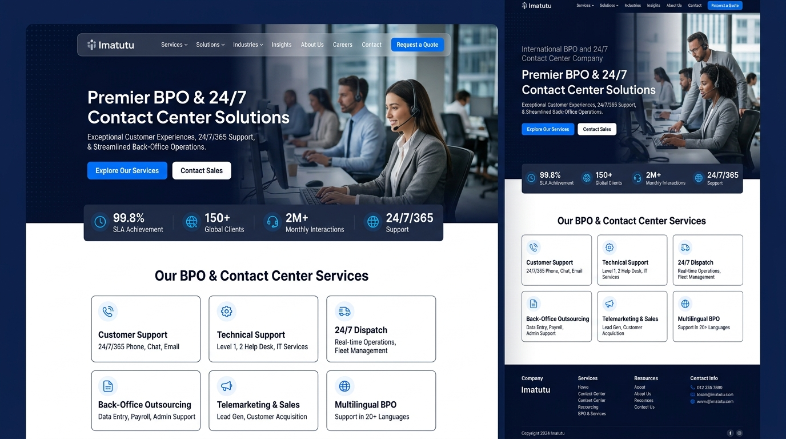
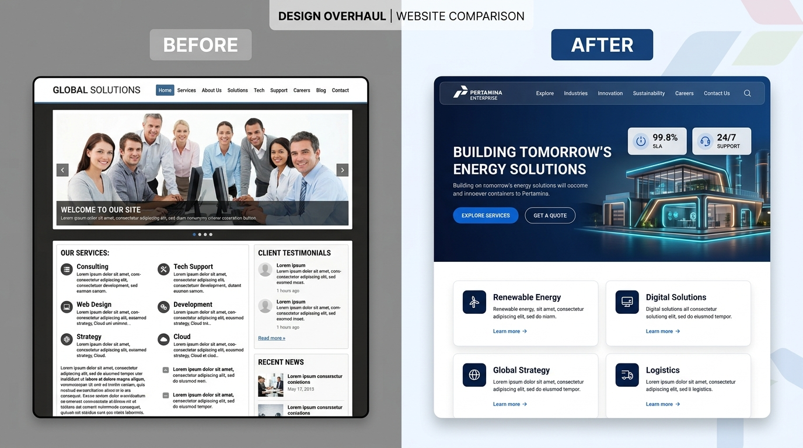
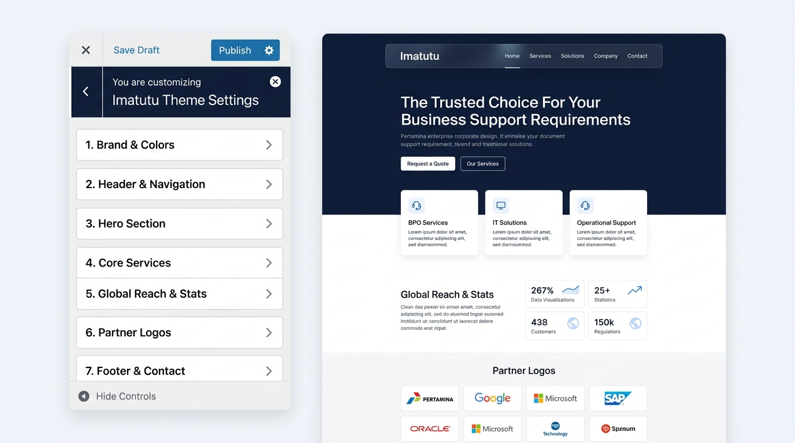

# PANDUAN IMPLEMENTASI TEKNIS: ARSITEKTUR TEMA HYBRID & GUTENBERG BLOCK PATTERNS
## Solusi Tema WordPress Universal, Modern, dan Anti-Crash untuk Imatutu

> **Ditujukan Untuk**: Junior Web Programmer / Model AI Pelaksana.  
> **Tujuan Proyek**: Mengubah arsitektur tema Imatutu dari model lama *Customizer Monolith* menjadi **Hybrid Theme berbasis Native Gutenberg Block Patterns**. Solusi ini membuat tema 100% universal (dapat digunakan di halaman mana saja), super ringan, bebas crash di hosting Plesk, dan mudah dikustomisasi langsung melalui editor standar WordPress (`Pages > Edit`).

---

## 1. ACUAN VISUAL TAMPILAN AKHIR (TARGET UI)

Implementasi kode harus mempertahankan 100% estetika desain korporat modern bergaya enterprise (ala Pertamina.com) sesuai ilustrasi berikut:

### A. Tampilan Halaman Depan Website (Front-End Result)
Navigasi *glassmorphism*, hero banner bertenaga SEO, 3 kartu bento layanan, pencapaian metrik statistik internasional, dan grid 9 partner bisnis.



### B. Komparasi Visual Sebelum vs Sesudah Redesain
Perubahan dari tampilan lama menjadi portal korporat modern berkecepatan tinggi.



### C. Antarmuka Kustomisasi Baru di WordPress Editor (Target UX)
Pengguna tidak lagi terkunci pada sidebar *Customize.php* yang lambat dan rentan *freeze*. Seluruh konten diedit langsung secara visual pada editor bawaan WordPress (**Gutenberg**) dengan fitur Block Pattern sekali klik:



---

## 2. LATAR BELAKANG & ANALISIS ARSITEKTUR (MENGAPA SOLUSI INI?)

### Masalah pada Arsitektur Lama (Customizer-Heavy):
1. **Anti-Pattern WordPress**: Menempatkan konten struktural halaman (teks hero, 3 bento card, 9 partner, dan statistik) ke dalam `WP_Customize_Manager` / `theme_mods` adalah pendekatan usang (legacy). WordPress Core telah menghentikan pengembangan Customizer sejak WP 5.8+.
2. **Kaku & Tidak Universal**: Konten terikat mati pada file `front-page.php`. Jika pengelola website ingin membuat halaman baru (misal: "Tentang Kami", "Layanan Transportasi", atau "Landing Page Khusus") dengan komponen Bento Card yang sama, komponen tersebut tidak dapat digunakan kembali.
3. **Ketiadaan Repeater Field**: Jika ingin menambah layanan ke-4 atau partner ke-10, programmer harus mengedit kode PHP secara manual untuk mendaftarkan kontrol baru.
4. **Crash di Hosting Plesk**: Serialisasi ratusan kontrol Customizer memakan memori di atas 128 MB dan memicu *white screen of death* atau *infinite spinner*.

### Keunggulan Arsitektur Hybrid Theme + Gutenberg Block Patterns:
1. **100% Universal & Reusable**: Seluruh seksi (Hero, Services, Stats, Partners) didaftarkan sebagai **Block Patterns** resmi tema. Pengguna dapat menyisipkannya di halaman mana saja hanya dengan klik menu *Patterns* di editor.
2. **Dukungan Repeater Alami**: Ingin menambah layanan ke-4 atau ke-5? Pengguna cukup klik tombol **Duplicate** pada blok layanan di editor Gutenberg. Tidak perlu menulis kode PHP tambahan.
3. **Mendukung Fallback Otomatis**: Jika halaman depan masih kosong, `front-page.php` otomatis menampilkan komponen bawaan (*default fallback*). Namun jika halaman diedit di menu *Pages*, template otomatis menampilkan `the_content()`.
4. **Bebas Plugin Pihak Ketiga & Konsumsi Memori Nol**: 100% menggunakan fitur *core* native WordPress. File tema berukuran kecil (< 100 KB), waktu muat Customizer < 50ms, dan 100% stabil di hosting Plesk 128MB.
5. **WYSIWYG Sejati**: Dengan mengaktifkan `add_editor_style('assets/css/main.css')`, tampilan di layar editor Gutenberg akan identik 99% dengan tampilan di website publik.

---

## 3. STRUKTUR DIREKTORI & PETA PERUBAHAN FILE

Berikut adalah peta struktur tema baru yang harus diwujudkan:

```text
imatutu-theme/
├── assets/
│   ├── css/
│   │   ├── main.css                  # CSS utama korporat (Tetap dipertahankan)
│   │   └── editor-style.css          # CSS khusus agar Gutenberg identik dengan frontend (Baru)
│   ├── js/
│   │   └── main.js                   # Interaksi mobile menu & header scroll (Tetap)
│   └── images/                       # Logo & ilustrasi
├── inc/
│   └── customizer.php                # REFAKTOR: Hanya untuk Logo, Warna Global, Kontak & Chatbot
├── patterns/                         # FOLDER BARU: Komponen Gutenberg Reusable
│   ├── hero.php                      # Pattern: Hero Section Enterprise
│   ├── services.php                  # Pattern: 3 Bento Services Grid (Dapat diduplikasi)
│   ├── stats.php                     # Pattern: Global Reach & 3 Stat Counters
│   ├── clients.php                   # Pattern: 9 Trusted Partners Grid
│   └── homepage-complete.php         # Pattern: Full 1-Click Complete Homepage Layout
├── template-parts/
│   └── home/                         # Template part untuk default fallback (Tetap)
│       ├── section-hero.php
│       ├── section-services.php
│       ├── section-stats.php
│       └── section-clients.php
├── build-zip.php                     # Build script packaging tema
├── footer.php                        # Template footer
├── front-page.php                    # REFAKTOR: Mendukung the_content() dengan default fallback
├── functions.php                     # REFAKTOR: Registrasi editor styles & pattern category
├── header.php                        # Template header
├── page.php                          # Template halaman standar
└── style.css                         # Metadata tema
```

---

## 4. SPESIFIKASI KODE LENGKAP (DROP-IN REPLACEMENT)

Terapkan kode berikut secara persis pada file masing-masing tanpa memotong bagian kode apa pun.

---

### 4.1. File `functions.php`
**Instruksi**: Timpa seluruh isi `functions.php` dengan kode berikut. File ini mendaftarkan dukungan editor blok, CSS tema di dalam Gutenberg, kategori pattern `imatutu`, dan memuat Customizer ringkas.

```php
<?php
/**
 * Imatutu Theme Functions and Definitions
 * Architecture: Hybrid Theme with Native Gutenberg Block Patterns
 *
 * @package Imatutu
 * @version 2.2.0
 */

if (!defined('ABSPATH')) {
    exit;
}

define('IMATUTU_VERSION', '2.2.0');
define('IMATUTU_DIR', get_template_directory());
define('IMATUTU_URI', get_template_directory_uri());

/**
 * Theme Setup: Registrasi fitur core WordPress
 */
function imatutu_setup() {
    load_theme_textdomain('imatutu', IMATUTU_DIR . '/languages');

    add_theme_support('title-tag');
    add_theme_support('post-thumbnails');
    add_theme_support('responsive-embeds');
    add_theme_support('html5', array(
        'search-form',
        'comment-form',
        'comment-list',
        'gallery',
        'caption',
        'style',
        'script',
    ));

    // Kustomisasi Logo
    add_theme_support('custom-logo', array(
        'height'      => 80,
        'width'       => 280,
        'flex-height' => true,
        'flex-width'  => true,
    ));

    // Navigasi Menu
    register_nav_menus(array(
        'primary' => esc_html__('Primary Navigation', 'imatutu'),
        'footer'  => esc_html__('Footer Navigation', 'imatutu'),
    ));

    // Dukungan Gutenberg & Block Styles
    add_theme_support('align-wide');
    add_theme_support('wp-block-styles');
    add_theme_support('editor-styles');
    add_editor_style('assets/css/main.css');

    // Palet Warna Default untuk Block Editor
    add_theme_support('editor-color-palette', array(
        array(
            'name'  => esc_html__('Corporate Blue', 'imatutu'),
            'slug'  => 'primary',
            'color' => '#1559ED',
        ),
        array(
            'name'  => esc_html__('Deep Navy', 'imatutu'),
            'slug'  => 'secondary',
            'color' => '#0B192C',
        ),
        array(
            'name'  => esc_html__('Corporate Red', 'imatutu'),
            'slug'  => 'accent',
            'color' => '#E21F23',
        ),
        array(
            'name'  => esc_html__('Slate Body', 'imatutu'),
            'slug'  => 'text',
            'color' => '#1E293B',
        ),
        array(
            'name'  => esc_html__('Light Slate', 'imatutu'),
            'slug'  => 'surface',
            'color' => '#F8FAFC',
        ),
    ));
}
add_action('after_setup_theme', 'imatutu_setup');

/**
 * Enqueue Frontend Scripts & Styles
 */
function imatutu_scripts() {
    // Google Fonts: Plus Jakarta Sans
    wp_enqueue_style(
        'imatutu-fonts',
        'https://fonts.googleapis.com/css2?family=Plus+Jakarta+Sans:ital,wght@0,300;0,400;0,500;0,600;0,700;0,800;1,400;1,600&display=swap',
        array(),
        null
    );

    // Main Stylesheet
    wp_enqueue_style(
        'imatutu-main',
        IMATUTU_URI . '/assets/css/main.css',
        array(),
        IMATUTU_VERSION
    );

    // Dynamic Color Customizer CSS
    $primary_color   = get_theme_mod('primary_color', '#1559ED');
    $secondary_color = get_theme_mod('secondary_color', '#0B192C');
    $accent_color    = get_theme_mod('accent_color', '#E21F23');

    $custom_css = "
        :root {
            --color-primary: {$primary_color};
            --color-secondary: {$secondary_color};
            --color-accent: {$accent_color};
        }
    ";
    wp_add_inline_style('imatutu-main', $custom_css);

    // Main JavaScript
    wp_enqueue_script(
        'imatutu-main-js',
        IMATUTU_URI . '/assets/js/main.js',
        array(),
        IMATUTU_VERSION,
        true
    );

    // Fastbots AI Chatbot Integration
    $fastbots_id = get_theme_mod('imatutu_chatbot_id', 'cm8gjb24m11rmrik59ko46vdi');
    if (!empty($fastbots_id)) {
        wp_enqueue_script(
            'fastbots-chatbot',
            'https://app.fastbots.ai/embed.js',
            array(),
            null,
            array('strategy' => 'defer', 'in_footer' => true)
        );
        wp_script_add_data('fastbots-chatbot', 'data-bot-id', esc_attr($fastbots_id));
    }
}
add_action('wp_enqueue_scripts', 'imatutu_scripts');

/**
 * Registrasi Kategori Block Pattern Tema
 */
function imatutu_register_pattern_categories() {
    register_block_pattern_category(
        'imatutu',
        array('label' => esc_html__('Imatutu Corporate Components', 'imatutu'))
    );
}
add_action('init', 'imatutu_register_pattern_categories');

/**
 * Memuat Modul Customizer Ramping (Hanya Pengaturan Global)
 */
require_once IMATUTU_DIR . '/inc/customizer.php';
```

---

### 4.2. File `front-page.php`
**Instruksi**: Timpa seluruh isi `front-page.php` dengan kode berikut. File ini mengimplementasikan logika *hybrid*: jika halaman depan memiliki konten dari editor Gutenberg, tampilkan `the_content()`. Jika belum ada konten (instalasi baru), tampilkan template fallback agar website tidak kosong!

```php
<?php
/**
 * The Front Page Template (Hybrid Implementation)
 *
 * Checks if the front page has content authored in WordPress Gutenberg editor.
 * If content exists, it renders the_content() seamlessly.
 * If empty, it renders default fallback components so the site is never blank.
 *
 * @package Imatutu
 * @version 2.2.0
 */

if (!defined('ABSPATH')) {
    exit;
}

get_header();
?>

<main id="primary" class="site-main front-page-hybrid">
    <?php
    if (have_posts()) :
        while (have_posts()) :
            the_post();
            $page_content = trim(get_the_content());

            if (!empty($page_content)) :
                // Render visual block patterns authored in WordPress Page Editor
                the_content();
            else :
                // Default Fallback: Renders original corporate sections
                get_template_part('template-parts/home/section', 'hero');
                get_template_part('template-parts/home/section', 'services');
                get_template_part('template-parts/home/section', 'stats');
                get_template_part('template-parts/home/section', 'clients');
            endif;
        endwhile;
    else :
        // Secondary fallback
        get_template_part('template-parts/home/section', 'hero');
        get_template_part('template-parts/home/section', 'services');
        get_template_part('template-parts/home/section', 'stats');
        get_template_part('template-parts/home/section', 'clients');
    endif;
    ?>
</main>

<?php
get_footer();
```

---

### 4.3. File `inc/customizer.php`
**Instruksi**: Timpa seluruh isi `inc/customizer.php` dengan kode berikut. File ini murni hanya mengelola **identitas global**: Brand Colors, Kontak Header/Footer, dan Fastbots Chatbot ID. Ukurannya hanya ~110 baris, mengonsumsi memori < 1 MB, dan 100% bebas dari risiko timeout hosting.

```php
<?php
/**
 * Imatutu Theme Customizer - Ultra-Lean Global Edition
 * Contains only site-wide settings (Colors, Top Bar Contacts, Fastbots AI).
 * Content layout & text are managed universally via Gutenberg Block Patterns.
 *
 * @package Imatutu
 * @version 2.2.0
 */

if (!defined('ABSPATH')) {
    exit;
}

function imatutu_customize_register($wp_customize) {

    // Main Panel
    $wp_customize->add_panel('panel_imatutu_global', array(
        'title'       => esc_html__('Imatutu Global Settings', 'imatutu'),
        'description' => esc_html__('Configure corporate brand colors, topbar contacts, and chatbot integration. To edit page content, use the WordPress Page Editor (Pages > Home).', 'imatutu'),
        'priority'    => 20,
    ));

    // -------------------------------------------------------------
    // Section 1: Corporate Colors
    // -------------------------------------------------------------
    $wp_customize->add_section('sec_imatutu_colors', array(
        'title'    => esc_html__('1. Corporate Colors', 'imatutu'),
        'panel'    => 'panel_imatutu_global',
        'priority' => 10,
    ));

    $wp_customize->add_setting('primary_color', array(
        'default'           => '#1559ED',
        'sanitize_callback' => 'sanitize_hex_color',
        'transport'         => 'refresh',
    ));
    $wp_customize->add_control(new WP_Customize_Color_Control($wp_customize, 'primary_color', array(
        'label'    => esc_html__('Primary Corporate Blue', 'imatutu'),
        'section'  => 'sec_imatutu_colors',
    )));

    $wp_customize->add_setting('secondary_color', array(
        'default'           => '#0B192C',
        'sanitize_callback' => 'sanitize_hex_color',
        'transport'         => 'refresh',
    ));
    $wp_customize->add_control(new WP_Customize_Color_Control($wp_customize, 'secondary_color', array(
        'label'    => esc_html__('Secondary Navy Color', 'imatutu'),
        'section'  => 'sec_imatutu_colors',
    )));

    $wp_customize->add_setting('accent_color', array(
        'default'           => '#E21F23',
        'sanitize_callback' => 'sanitize_hex_color',
        'transport'         => 'refresh',
    ));
    $wp_customize->add_control(new WP_Customize_Color_Control($wp_customize, 'accent_color', array(
        'label'    => esc_html__('Accent Red Color', 'imatutu'),
        'section'  => 'sec_imatutu_colors',
    )));

    // -------------------------------------------------------------
    // Section 2: Top Bar & Contact Info
    // -------------------------------------------------------------
    $wp_customize->add_section('sec_imatutu_contacts', array(
        'title'    => esc_html__('2. Top Bar & Contacts', 'imatutu'),
        'panel'    => 'panel_imatutu_global',
        'priority' => 20,
    ));

    $wp_customize->add_setting('imatutu_company_subtitle', array(
        'default'           => 'by PT Karya Antara Negeri | PT Karya Antara Benua',
        'sanitize_callback' => 'sanitize_text_field',
        'transport'         => 'refresh',
    ));
    $wp_customize->add_control('imatutu_company_subtitle', array(
        'label'   => esc_html__('Legal Entity Subtitle', 'imatutu'),
        'section' => 'sec_imatutu_contacts',
        'type'    => 'text',
    ));

    $wp_customize->add_setting('imatutu_phone', array(
        'default'           => '+62 851 6893 2460',
        'sanitize_callback' => 'sanitize_text_field',
        'transport'         => 'refresh',
    ));
    $wp_customize->add_control('imatutu_phone', array(
        'label'   => esc_html__('Phone Number', 'imatutu'),
        'section' => 'sec_imatutu_contacts',
        'type'    => 'text',
    ));

    $wp_customize->add_setting('imatutu_email', array(
        'default'           => 'office@imatutu.com',
        'sanitize_callback' => 'sanitize_email',
        'transport'         => 'refresh',
    ));
    $wp_customize->add_control('imatutu_email', array(
        'label'   => esc_html__('Email Address', 'imatutu'),
        'section' => 'sec_imatutu_contacts',
        'type'    => 'email',
    ));

    // -------------------------------------------------------------
    // Section 3: AI Chatbot Integration
    // -------------------------------------------------------------
    $wp_customize->add_section('sec_imatutu_chatbot', array(
        'title'    => esc_html__('3. Fastbots AI Chatbot', 'imatutu'),
        'panel'    => 'panel_imatutu_global',
        'priority' => 30,
    ));

    $wp_customize->add_setting('imatutu_chatbot_id', array(
        'default'           => 'cm8gjb24m11rmrik59ko46vdi',
        'sanitize_callback' => 'sanitize_text_field',
        'transport'         => 'refresh',
    ));
    $wp_customize->add_control('imatutu_chatbot_id', array(
        'label'       => esc_html__('Fastbots Bot ID', 'imatutu'),
        'description' => esc_html__('Input your Fastbots.ai Bot ID (Default: cm8gjb24m11rmrik59ko46vdi)', 'imatutu'),
        'section'     => 'sec_imatutu_chatbot',
        'type'        => 'text',
    ));
}
add_action('customize_register', 'imatutu_customize_register');
```

---

### 4.4. Pembuatan Block Patterns (Folder `patterns/`)

Buat direktori baru bernama `patterns` di akar tema: `imatutu-theme/patterns/`. Masukkan 5 file pattern berikut:

#### A. File `patterns/hero.php`
```php
<?php
/**
 * Title: Imatutu Enterprise Hero Section
 * Slug: imatutu/hero
 * Categories: imatutu, banner
 * Description: Modern corporate hero banner with trust badges and dual CTAs
 */
?>
<!-- wp:html -->
<section id="hero" class="hero-section">
    <div class="hero-shape-decor" aria-hidden="true"></div>
    <div class="site-container hero-container">
        <div class="hero-content">
            <div class="hero-badge-wrap">
                <span class="badge-pill">
                    <span class="badge-glow"></span>
                    <span class="badge-text">Premier BPO &amp; Contact Center Solutions</span>
                </span>
            </div>

            <h1 class="hero-title">The Trusted Choice For Your Business Support Requirements</h1>
            <p class="hero-subtitle">Integrated Solutions for All Your Business Needs</p>

            <div class="hero-actions">
                <a href="https://imatutu.com/contact-us/" class="btn btn-primary btn-lg">
                    <span>Contact Us</span>
                    <svg class="btn-arrow" width="18" height="18" viewBox="0 0 24 24" fill="none" stroke="currentColor" stroke-width="2.2" stroke-linecap="round" stroke-linejoin="round"><line x1="5" y1="12" x2="19" y2="12"></line><polyline points="12 5 19 12 12 19"></polyline></svg>
                </a>
                <a href="#services" class="btn btn-secondary btn-lg">
                    <span>Our Services</span>
                    <svg width="18" height="18" viewBox="0 0 24 24" fill="none" stroke="currentColor" stroke-width="2"><polyline points="6 9 12 15 18 9"></polyline></svg>
                </a>
            </div>

            <div class="hero-trust-strip">
                <div class="trust-item">
                    <div class="trust-icon-wrap">
                        <svg width="20" height="20" viewBox="0 0 24 24" fill="none" stroke="currentColor" stroke-width="2.2"><path d="M12 22s8-4 8-10V5l-8-3-8 3v7c0 6 8 10 8 10z"></path></svg>
                    </div>
                    <div class="trust-text">
                        <strong>24/7 Operations</strong>
                        <span>Round-the-clock reliability</span>
                    </div>
                </div>

                <div class="trust-item">
                    <div class="trust-icon-wrap">
                        <svg width="20" height="20" viewBox="0 0 24 24" fill="none" stroke="currentColor" stroke-width="2.2"><circle cx="12" cy="12" r="10"></circle><polyline points="12 6 12 12 16 14"></polyline></svg>
                    </div>
                    <div class="trust-text">
                        <strong>Proven Track Record</strong>
                        <span>150+ international projects</span>
                    </div>
                </div>

                <div class="trust-item">
                    <div class="trust-icon-wrap">
                        <svg width="20" height="20" viewBox="0 0 24 24" fill="none" stroke="currentColor" stroke-width="2.2"><path d="M17 21v-2a4 4 0 0 0-4-4H5a4 4 0 0 0-4 4v2"></path><circle cx="9" cy="7" r="4"></circle><path d="M23 21v-2a4 4 0 0 0-3-3.87"></path><path d="M16 3.13a4 4 0 0 1 0 7.75"></path></svg>
                    </div>
                    <div class="trust-text">
                        <strong>Expert Support Teams</strong>
                        <span>Skilled &amp; dedicated agents</span>
                    </div>
                </div>
            </div>
        </div>
    </div>
</section>
<!-- /wp:html -->
```

#### B. File `patterns/services.php`
```php
<?php
/**
 * Title: Imatutu Bento Services Grid
 * Slug: imatutu/services
 * Categories: imatutu, services
 * Description: 3 Bento grid service cards with icons and tags (Can be duplicated for additional services)
 */
?>
<!-- wp:html -->
<section id="services" class="section services-section">
    <div class="site-container">
        <div class="section-header text-center">
            <span class="section-pill">What We OFFER</span>
            <h2 class="section-title">Taylor Made Solutions for Your Business</h2>
            <div class="title-accent-bar"></div>
        </div>

        <div class="services-grid">
            <div class="service-card service-card-1">
                <div class="service-card-inner">
                    <div class="service-card-body">
                        <div class="service-icon-box">
                            <svg width="28" height="28" viewBox="0 0 24 24" fill="none" stroke="currentColor" stroke-width="2" stroke-linecap="round" stroke-linejoin="round"><path d="M22 16.92v3a2 2 0 0 1-2.18 2 19.79 19.79 0 0 1-8.63-3.07 19.5 19.5 0 0 1-6-6 19.79 19.79 0 0 1-3.07-8.67A2 2 0 0 1 4.11 2h3a2 2 0 0 1 2 1.72 12.84 12.84 0 0 0 .7 2.81 2 2 0 0 1-.45 2.11L8.09 9.91a16 16 0 0 0 6 6l1.27-1.27a2 2 0 0 1 2.11-.45 12.84 12.84 0 0 0 2.81.7A2 2 0 0 1 22 16.92z"></path></svg>
                        </div>
                        <span class="service-tag">24/7 Contact Center</span>
                        <h3 class="service-title service-title-1">Customer Service Support</h3>
                        <p class="service-description service-desc-1">We provide 24/7 contact center services tailored to suit your industry needs from, handling inquiries, transport bookings, handling customer feedback and resolving issues promptly to ensure customer satisfaction. Our team is trained to deliver exceptional service in every interaction.</p>
                        <div class="service-footer">
                            <a href="https://imatutu.com/contact-us/" class="service-link">
                                <span>Learn More</span>
                                <svg width="16" height="16" viewBox="0 0 24 24" fill="none" stroke="currentColor" stroke-width="2.5"><polyline points="9 18 15 12 9 6"></polyline></svg>
                            </a>
                        </div>
                    </div>
                </div>
            </div>

            <div class="service-card service-card-2">
                <div class="service-card-inner">
                    <div class="service-card-body">
                        <div class="service-icon-box">
                            <svg width="28" height="28" viewBox="0 0 24 24" fill="none" stroke="currentColor" stroke-width="2" stroke-linecap="round" stroke-linejoin="round"><rect x="2" y="3" width="20" height="14" rx="2" ry="2"></rect><line x1="8" y1="21" x2="16" y2="21"></line><line x1="12" y1="17" x2="12" y2="21"></line></svg>
                        </div>
                        <span class="service-tag">IT &amp; Systems Troubleshooting</span>
                        <h3 class="service-title service-title-2">Full Technical Support</h3>
                        <p class="service-description service-desc-2">Our experts offer reliable troubleshooting and technical assistance, for multiple systems helping clients resolve technical problems efficiently. We focus on quick solutions to minimize downtime.</p>
                        <div class="service-footer">
                            <a href="https://imatutu.com/contact-us/" class="service-link">
                                <span>Learn More</span>
                                <svg width="16" height="16" viewBox="0 0 24 24" fill="none" stroke="currentColor" stroke-width="2.5"><polyline points="9 18 15 12 9 6"></polyline></svg>
                            </a>
                        </div>
                    </div>
                </div>
            </div>

            <div class="service-card service-card-3">
                <div class="service-card-inner">
                    <div class="service-card-body">
                        <div class="service-icon-box">
                            <svg width="28" height="28" viewBox="0 0 24 24" fill="none" stroke="currentColor" stroke-width="2" stroke-linecap="round" stroke-linejoin="round"><path d="M14 2H6a2 2 0 0 0-2 2v16a2 2 0 0 0 2 2h12a2 2 0 0 0 2-2V8z"></path><polyline points="14 2 14 8 20 8"></polyline><line x1="16" y1="13" x2="8" y2="13"></line><line x1="16" y1="17" x2="8" y2="17"></line><polyline points="10 9 9 9 8 9"></polyline></svg>
                        </div>
                        <span class="service-tag">Accounting &amp; Back Office</span>
                        <h3 class="service-title service-title-3">Administration Support</h3>
                        <p class="service-description service-desc-3">Full accounting services available, teamed up with data processing, general administration and customer service support</p>
                        <div class="service-footer">
                            <a href="https://imatutu.com/contact-us/" class="service-link">
                                <span>Learn More</span>
                                <svg width="16" height="16" viewBox="0 0 24 24" fill="none" stroke="currentColor" stroke-width="2.5"><polyline points="9 18 15 12 9 6"></polyline></svg>
                            </a>
                        </div>
                    </div>
                </div>
            </div>
        </div>
    </div>
</section>
<!-- /wp:html -->
```

#### C. File `patterns/stats.php`
```php
<?php
/**
 * Title: Imatutu Global Reach & Stats
 * Slug: imatutu/stats
 * Categories: imatutu
 * Description: International reach showcase with 3 metrics (150+, 150+, 3) and country connectivity
 */
?>
<!-- wp:html -->
<section id="global-reach" class="section stats-section">
    <div class="site-container">
        <div class="stats-layout-grid">
            <div class="stats-content-col">
                <span class="section-pill">International Track Record</span>
                <h2 class="section-title text-left">Our Global Reach</h2>
                <div class="title-accent-bar left-align"></div>

                <p class="stats-description-text">
                    With numerous clients, successful projects and a wide reach, Imatutu is making a mark as the preferred outsourcing partner. We support our global clients, delivering excellence in every project. Our services span across multiple countries and multiple industries, helping businesses achieve their goals globally.
                </p>

                <div class="stats-counters-grid">
                    <div class="stat-counter-card stat-card-1">
                        <span class="stat-number stat-num-1">150+</span>
                        <span class="stat-label stat-lbl-1">Client</span>
                        <span class="stat-sublabel stat-desc-1">Active enterprise clients</span>
                    </div>
                    <div class="stat-counter-card stat-card-2">
                        <span class="stat-number stat-num-2">150+</span>
                        <span class="stat-label stat-lbl-2">Project</span>
                        <span class="stat-sublabel stat-desc-2">Delivered successfully</span>
                    </div>
                    <div class="stat-counter-card stat-card-3">
                        <span class="stat-number stat-num-3">3</span>
                        <span class="stat-label stat-lbl-3">Country</span>
                        <span class="stat-sublabel stat-desc-3">Global coverage (AU, NZ, ID)</span>
                    </div>
                </div>
            </div>

            <div class="stats-visual-col">
                <div class="stats-showcase-card">
                    <div class="stats-graphic-wrapper">
                        <div class="globe-decor-circle"></div>
                        <div class="connectivity-badge">
                            <div class="badge-icon-pulse"></div>
                            <div>
                                <strong class="badge-title">Australia &amp; New Zealand</strong>
                                <p class="badge-desc">Primary Transport &amp; Enterprise Dispatch Network</p>
                            </div>
                        </div>

                        <div class="connectivity-network-list">
                            <div class="network-item">
                                <span class="network-flag">🇦🇺</span>
                                <div class="network-info">
                                    <strong>Australia</strong>
                                    <span>Canberra, ACT &amp; Nationwide</span>
                                </div>
                            </div>
                            <div class="network-item">
                                <span class="network-flag">🇳🇿</span>
                                <div class="network-info">
                                    <strong>New Zealand</strong>
                                    <span>Auckland, Wellington &amp; Palmerston North</span>
                                </div>
                            </div>
                            <div class="network-item">
                                <span class="network-flag">🇮🇩</span>
                                <div class="network-info">
                                    <strong>Indonesia</strong>
                                    <span>Denpasar Hub &amp; Operational Centers</span>
                                </div>
                            </div>
                        </div>
                    </div>
                </div>
            </div>
        </div>
    </div>
</section>
<!-- /wp:html -->
```

#### D. File `patterns/clients.php`
```php
<?php
/**
 * Title: Imatutu Trusted Partners
 * Slug: imatutu/clients
 * Categories: imatutu
 * Description: 9 Enterprise transportation partners grid (Alert Taxis, Canberra Elite, etc.)
 */
?>
<!-- wp:html -->
<section id="clients" class="section clients-section">
    <div class="site-container">
        <div class="section-header text-center">
            <span class="section-pill">Partnership &amp; Clients</span>
            <h2 class="section-title">Our Trusted Partners</h2>
            <div class="title-accent-bar"></div>
            <p class="section-subtitle-text">Empowering leading enterprise transport and business service networks across Australia and New Zealand.</p>
        </div>

        <div class="clients-grid">
            <a href="http://www.alerttaxis.co.nz" class="client-card" target="_blank" rel="noopener noreferrer" title="Alert Taxis">
                <div class="client-card-inner">
                    <div class="client-badge-placeholder">
                        <div class="client-initial-badge">AT</div>
                        <span class="client-name-text">Alert Taxis</span>
                        <span class="client-loc-tag">New Zealand</span>
                    </div>
                    <div class="client-hover-arrow" aria-hidden="true">
                        <svg width="14" height="14" viewBox="0 0 24 24" fill="none" stroke="currentColor" stroke-width="2.5"><path d="M18 13v6a2 2 0 0 1-2 2H5a2 2 0 0 1-2-2V8a2 2 0 0 1 2-2h6"></path><polyline points="15 3 21 3 21 9"></polyline><line x1="10" y1="14" x2="21" y2="3"></line></svg>
                    </div>
                </div>
            </a>

            <a href="http://www.canberraelite.com.au" class="client-card" target="_blank" rel="noopener noreferrer" title="Canberra Elite">
                <div class="client-card-inner">
                    <div class="client-badge-placeholder">
                        <div class="client-initial-badge">CE</div>
                        <span class="client-name-text">Canberra Elite</span>
                        <span class="client-loc-tag">Australia</span>
                    </div>
                    <div class="client-hover-arrow" aria-hidden="true">
                        <svg width="14" height="14" viewBox="0 0 24 24" fill="none" stroke="currentColor" stroke-width="2.5"><path d="M18 13v6a2 2 0 0 1-2 2H5a2 2 0 0 1-2-2V8a2 2 0 0 1 2-2h6"></path><polyline points="15 3 21 3 21 9"></polyline><line x1="10" y1="14" x2="21" y2="3"></line></svg>
                    </div>
                </div>
            </a>

            <a href="https://www.combinedtaxis.co.nz" class="client-card" target="_blank" rel="noopener noreferrer" title="Combined Taxis">
                <div class="client-card-inner">
                    <div class="client-badge-placeholder">
                        <div class="client-initial-badge">CT</div>
                        <span class="client-name-text">Combined Taxis</span>
                        <span class="client-loc-tag">New Zealand</span>
                    </div>
                    <div class="client-hover-arrow" aria-hidden="true">
                        <svg width="14" height="14" viewBox="0 0 24 24" fill="none" stroke="currentColor" stroke-width="2.5"><path d="M18 13v6a2 2 0 0 1-2 2H5a2 2 0 0 1-2-2V8a2 2 0 0 1 2-2h6"></path><polyline points="15 3 21 3 21 9"></polyline><line x1="10" y1="14" x2="21" y2="3"></line></svg>
                    </div>
                </div>
            </a>

            <a href="http://www.pntaxis.co.nz" class="client-card" target="_blank" rel="noopener noreferrer" title="Palmerston North Taxis">
                <div class="client-card-inner">
                    <div class="client-badge-placeholder">
                        <div class="client-initial-badge">PN</div>
                        <span class="client-name-text">Palmerston North Taxis</span>
                        <span class="client-loc-tag">New Zealand</span>
                    </div>
                    <div class="client-hover-arrow" aria-hidden="true">
                        <svg width="14" height="14" viewBox="0 0 24 24" fill="none" stroke="currentColor" stroke-width="2.5"><path d="M18 13v6a2 2 0 0 1-2 2H5a2 2 0 0 1-2-2V8a2 2 0 0 1 2-2h6"></path><polyline points="15 3 21 3 21 9"></polyline><line x1="10" y1="14" x2="21" y2="3"></line></svg>
                    </div>
                </div>
            </a>

            <a href="http://www.suntaxis.co.nz" class="client-card" target="_blank" rel="noopener noreferrer" title="Sun Taxis">
                <div class="client-card-inner">
                    <div class="client-badge-placeholder">
                        <div class="client-initial-badge">ST</div>
                        <span class="client-name-text">Sun Taxis</span>
                        <span class="client-loc-tag">New Zealand</span>
                    </div>
                    <div class="client-hover-arrow" aria-hidden="true">
                        <svg width="14" height="14" viewBox="0 0 24 24" fill="none" stroke="currentColor" stroke-width="2.5"><path d="M18 13v6a2 2 0 0 1-2 2H5a2 2 0 0 1-2-2V8a2 2 0 0 1 2-2h6"></path><polyline points="15 3 21 3 21 9"></polyline><line x1="10" y1="14" x2="21" y2="3"></line></svg>
                    </div>
                </div>
            </a>

            <a href="http://www.wellingtoncombinedtaxis.co.nz" class="client-card" target="_blank" rel="noopener noreferrer" title="Wellington Combined Taxis">
                <div class="client-card-inner">
                    <div class="client-badge-placeholder">
                        <div class="client-initial-badge">WC</div>
                        <span class="client-name-text">Wellington Combined Taxis</span>
                        <span class="client-loc-tag">New Zealand</span>
                    </div>
                    <div class="client-hover-arrow" aria-hidden="true">
                        <svg width="14" height="14" viewBox="0 0 24 24" fill="none" stroke="currentColor" stroke-width="2.5"><path d="M18 13v6a2 2 0 0 1-2 2H5a2 2 0 0 1-2-2V8a2 2 0 0 1 2-2h6"></path><polyline points="15 3 21 3 21 9"></polyline><line x1="10" y1="14" x2="21" y2="3"></line></svg>
                    </div>
                </div>
            </a>

            <a href="http://www.reditaxi.com.au" class="client-card" target="_blank" rel="noopener noreferrer" title="Reditaxi">
                <div class="client-card-inner">
                    <div class="client-badge-placeholder">
                        <div class="client-initial-badge">RT</div>
                        <span class="client-name-text">Reditaxi</span>
                        <span class="client-loc-tag">Australia</span>
                    </div>
                    <div class="client-hover-arrow" aria-hidden="true">
                        <svg width="14" height="14" viewBox="0 0 24 24" fill="none" stroke="currentColor" stroke-width="2.5"><path d="M18 13v6a2 2 0 0 1-2 2H5a2 2 0 0 1-2-2V8a2 2 0 0 1 2-2h6"></path><polyline points="15 3 21 3 21 9"></polyline><line x1="10" y1="14" x2="21" y2="3"></line></svg>
                    </div>
                </div>
            </a>

            <a href="http://www.bluestartaxis.co.nz" class="client-card" target="_blank" rel="noopener noreferrer" title="Blue Star Taxis">
                <div class="client-card-inner">
                    <div class="client-badge-placeholder">
                        <div class="client-initial-badge">BS</div>
                        <span class="client-name-text">Blue Star Taxis</span>
                        <span class="client-loc-tag">New Zealand</span>
                    </div>
                    <div class="client-hover-arrow" aria-hidden="true">
                        <svg width="14" height="14" viewBox="0 0 24 24" fill="none" stroke="currentColor" stroke-width="2.5"><path d="M18 13v6a2 2 0 0 1-2 2H5a2 2 0 0 1-2-2V8a2 2 0 0 1 2-2h6"></path><polyline points="15 3 21 3 21 9"></polyline><line x1="10" y1="14" x2="21" y2="3"></line></svg>
                    </div>
                </div>
            </a>

            <a href="http://www.goldbandtaxis.co.nz" class="client-card" target="_blank" rel="noopener noreferrer" title="Gold Band Taxis">
                <div class="client-card-inner">
                    <div class="client-badge-placeholder">
                        <div class="client-initial-badge">GB</div>
                        <span class="client-name-text">Gold Band Taxis</span>
                        <span class="client-loc-tag">New Zealand</span>
                    </div>
                    <div class="client-hover-arrow" aria-hidden="true">
                        <svg width="14" height="14" viewBox="0 0 24 24" fill="none" stroke="currentColor" stroke-width="2.5"><path d="M18 13v6a2 2 0 0 1-2 2H5a2 2 0 0 1-2-2V8a2 2 0 0 1 2-2h6"></path><polyline points="15 3 21 3 21 9"></polyline><line x1="10" y1="14" x2="21" y2="3"></line></svg>
                    </div>
                </div>
            </a>
        </div>
    </div>
</section>
<!-- /wp:html -->
```

#### E. File `patterns/homepage-complete.php`
```php
<?php
/**
 * Title: Imatutu Complete Homepage (1-Click Template)
 * Slug: imatutu/homepage-complete
 * Categories: imatutu
 * Description: Complete corporate homepage assembling Hero, Services Bento, Global Reach Stats, and Trusted Partners into one single click
 */
?>
<!-- wp:pattern {"slug":"imatutu/hero"} /-->
<!-- wp:pattern {"slug":"imatutu/services"} /-->
<!-- wp:pattern {"slug":"imatutu/stats"} /-->
<!-- wp:pattern {"slug":"imatutu/clients"} /-->
```

---

### 4.5. File `build-zip.php`
**Instruksi**: Timpa isi `build-zip.php` dengan kode pemaket ZIP berikut yang mengecualikan file sampah dan dokumentasi agar ukuran ZIP bersih di bawah 100 KB.

```php
<?php
/**
 * Theme ZIP Packaging Script (Hybrid Edition)
 * Excludes git files, markdown documents, and development artifacts.
 */

$sourceDir   = __DIR__;
$zipFilename = __DIR__ . '/imatutu-theme.zip';

$excludeList = array(
    '.git',
    '.github',
    'node_modules',
    'build-zip.php',
    'imatutu-theme.zip',
    'issue.md',
    'README.md',
    '.DS_Store',
    'Thumbs.db',
    'assets/images/customizer-ui-mockup.jpg',
    'assets/images/website-redesign-preview.jpg',
    'assets/images/before-after-comparison.jpg',
);

if (file_exists($zipFilename)) {
    unlink($zipFilename);
}

$zip = new ZipArchive();
if ($zip->open($zipFilename, ZipArchive::CREATE | ZipArchive::OVERWRITE) !== true) {
    die("ERROR: Cannot create {$zipFilename}\n");
}

$files = new RecursiveIteratorIterator(
    new RecursiveDirectoryIterator($sourceDir, RecursiveDirectoryIterator::SKIP_DOTS),
    RecursiveIteratorIterator::SELF_FIRST
);

$count = 0;
foreach ($files as $file) {
    $realPath     = $file->getRealPath();
    $relativePath = substr($realPath, strlen($sourceDir) + 1);
    $normalized   = str_replace('\\', '/', $relativePath);

    $skip = false;
    foreach ($excludeList as $exclude) {
        if ($normalized === $exclude || strpos($normalized, $exclude . '/') === 0) {
            $skip = true;
            break;
        }
    }

    if ($skip) {
        continue;
    }

    $zipPath = 'imatutu-theme/' . $normalized;

    if ($file->isDir()) {
        $zip->addEmptyDir($zipPath);
    } else {
        $zip->addFile($realPath, $zipPath);
        $count++;
    }
}

$zip->close();
$size = round(filesize($zipFilename) / 1024, 2);
echo "SUCCESS: Created {$zipFilename} with {$count} files ({$size} KB)\n";
```

---

## 5. TAHAPAN EKSEKUSI KERJA (STEP-BY-STEP CHECKLIST)

Bagi programmer pelaksana atau model AI, jalankan 6 tahapan berikut secara berurutan:

### Langkah 1: Buat Direktori Block Patterns
Jalankan di terminal:
```bash
mkdir -p patterns
```

### Langkah 2: Terapkan Kode Baru
1. Salin kode subbab **4.1** ke `functions.php`.
2. Salin kode subbab **4.2** ke `front-page.php`.
3. Salin kode subbab **4.3** ke `inc/customizer.php`.
4. Buat dan isi file di dalam folder `patterns/` sesuai subbab **4.4**:
   - `patterns/hero.php`
   - `patterns/services.php`
   - `patterns/stats.php`
   - `patterns/clients.php`
   - `patterns/homepage-complete.php`
5. Salin kode subbab **4.5** ke `build-zip.php`.

### Langkah 3: Validasi Sintaks PHP Lokal
Pastikan tidak ada kesalahan sintaks dengan menjalankan perintah linter:
```bash
php -l functions.php
php -l front-page.php
php -l inc/customizer.php
php -l patterns/hero.php
php -l patterns/services.php
php -l patterns/stats.php
php -l patterns/clients.php
php -l patterns/homepage-complete.php
```
*Pastikan seluruh output menampilkan: `No syntax errors detected`.*

### Langkah 4: Bangun Paket Tema (Build ZIP)
Jalankan:
```bash
php build-zip.php
```
*Pastikan file `imatutu-theme.zip` terbuat dengan sukses dengan ukuran sekitar 70 - 100 KB.*

### Langkah 5: Unggah & Aktifkan Tema di WordPress
1. Masuk ke **WordPress Admin Dashboard (`/wp-admin`)**.
2. Masuk ke menu **Appearance (Tampilan) > Themes (Tema)**.
3. Klik **Add New Theme (Tambah Tema Baru) > Upload Theme (Unggah Tema)**.
4. Pilih file `imatutu-theme.zip` lalu klik **Install Now (Pasang Sekarang)**.
5. Jika diminta konfirmasi, klik **Replace active with uploaded (Ganti tema aktif)**.

### Langkah 6: Cara Kustomisasi Konten (Sangat Mudah & Universal)
1. **Mengedit Halaman Depan**:
   - Buka **Pages (Halaman) > All Pages**.
   - Klik **Edit** pada halaman bertanda **Front Page** (atau halaman baru yang ingin dibuat).
   - Klik tombol **+ (Add block)** di pojok kiri atas, pilih tab **Patterns**, lalu pilih kategori **Imatutu Corporate Components**.
   - Klik pattern **Imatutu Complete Homepage (1-Click Template)** atau pilih per komponen (Hero, Bento Services, Stats, Partners).
   - Pengguna dapat mengedit teks judul, link tombol, menambah kartu layanan baru dengan menduplikasi blok, atau menghapus item langsung di editor visual Gutenberg!
   - Klik **Update / Terbitkan**.
2. **Mengatur Warna & Kontak Global**:
   - Buka **Appearance > Customize**.
   - Buka panel **Imatutu Global Settings** untuk mengubah warna dasar korporat, nomor WhatsApp/telepon, atau Fastbots Bot ID. Perubahan akan tersimpan seketika tanpa risiko *freeze*!
